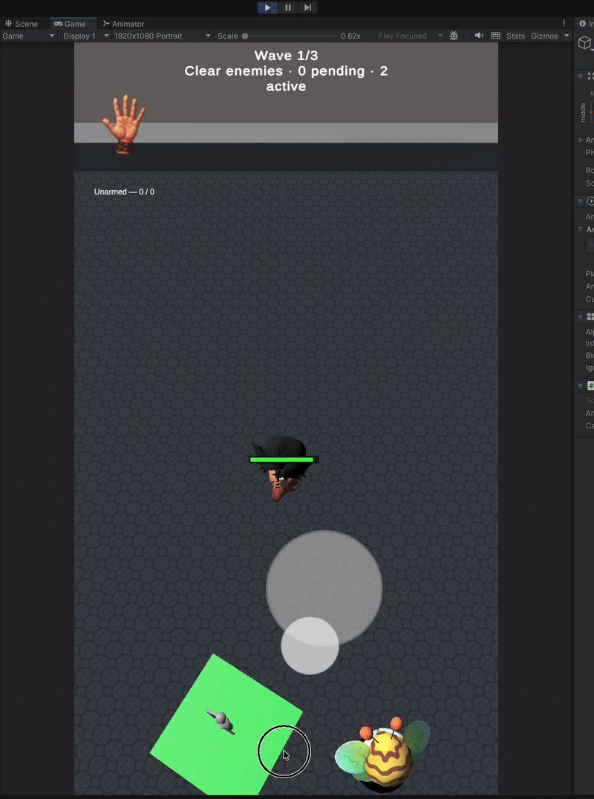
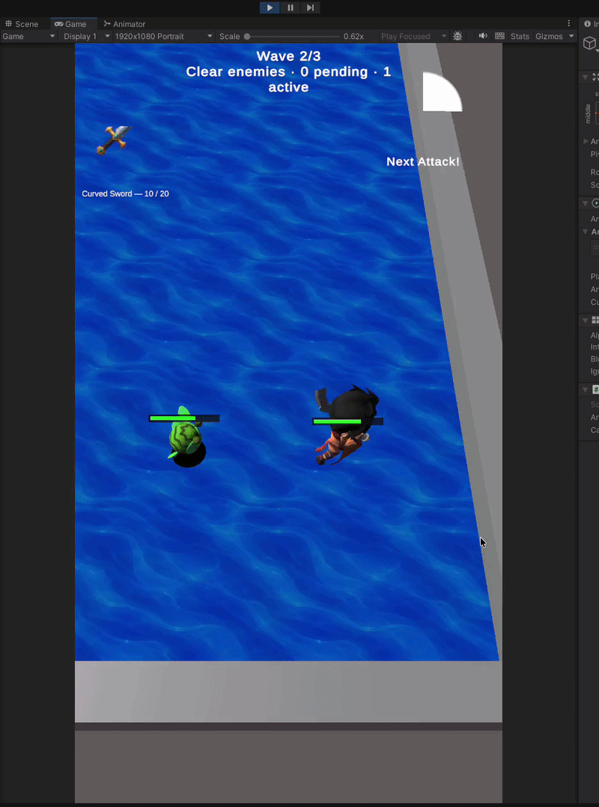
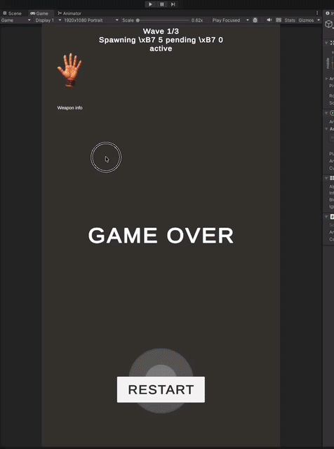
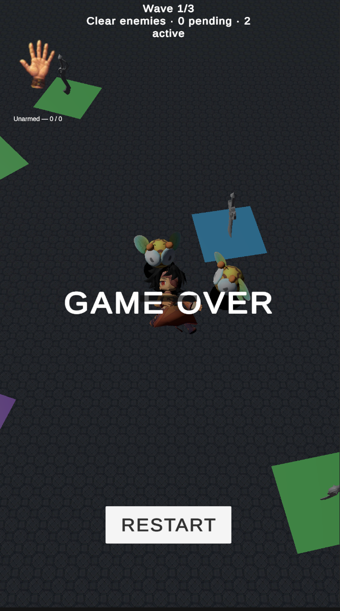
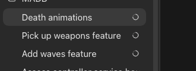
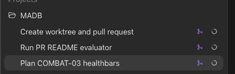

# Game Feel Home Assignment

A top down arena prototype, extended to feel better to play: readable combat, clear damage, and a
short progression loop, kept inside a measured frame budget on a real device.

Unity `2022.3.62f2`. Generated API docs and the codebase map are on
[GitHub Pages](https://ricardcabezas.github.io/game_dev_case-variation-feel/).

> **What I changed:** [`v0` is the project as I received it](https://github.com/RicardCabezas/game_dev_case-variation-feel/releases/tag/v0),
> `v1` is this submission.
> **[See the full diff (`v0...v1`)](https://github.com/RicardCabezas/game_dev_case-variation-feel/compare/v0...v1)**
>
> **Time: around 11 hours, over the 8 hour limit.** Per feature breakdown and what I would have cut
> is in [Time and scope](#time-and-scope).

---

## Running it

Open the project in Unity **2022.3.62f2** and play `Assets/Scenes/MainScene.unity`. It works in the
Editor with the mouse and on device with touch. The hero, arena and biomes are all spawned at
runtime by services, so the scene itself is nearly empty.

**Controls** (one pointer, no keyboard):

| Input | Action |
|---|---|
| Press and drag | Move. The joystick appears where you press. |
| Release | Stop, then auto attack the nearest enemy in range while idle. |
| **Second press within 0.25s**, drag, release | **Dash** in the aimed direction. Kills what it passes through and destroys your weapon. |
| Walk over a pickup | Equip that weapon, replacing the current one. |

The dash is the only input that is not obvious. It is a double tap where the second tap is held to
aim and released to commit. A release with almost no drag is ignored, so a normal double tap will
not trigger it by accident.

---

## Contents

- [What I built and why](#what-i-built-and-why)
- [Performance and profiling](#performance-and-profiling)
- [Time and scope](#time-and-scope)
- [Trade-offs and known issues](#trade-offs-and-known-issues)
- [Code quality](#code-quality)
- [AI usage](#ai-usage)
- [Base project feedback](#base-project-feedback)

**Other documents**

| Document | What it is |
|---|---|
| [`docs/performance.md`](docs/performance.md) | Full profiling write up: method, all 15 device captures, memory snapshots |
| [`docs/codebase-map.md`](docs/codebase-map.md) | Map of ownership, lifecycle and presentation boundaries |
| [`docs/analysis/architecture-review.md`](docs/analysis/architecture-review.md) | A critical review of this codebase: findings, dependency graphs, and what I would change with more time. Written to be useful, not flattering. |

---

## What I built and why

I treated this as an inherited project. Understand the game first, then make small changes with
clear value.

The base project had a working combat loop with almost no feedback. You could not tell when an
attack was possible, whether a hit landed, or how close an enemy was to dying. Bees overlapped into
one unreadable mass. So my priority was legibility first, weight second. The player should always
know what just happened and what they can do next, before anything is made to feel impactful.

The brief asks for small supporting systems, and I added more than that: waves, weapon pickups with
durability, biomes and the dash. Each one exists to give feedback something to be about, since
progress and risk are hard to feel without stakes. But it is more scope than was asked for, and
[Time and scope](#time-and-scope) says which of them I would cut.

### See it running

| The core loop | The dash |
|---|---|
|  |  |
| Starts **unarmed** (`0 / 0`) in the dungeon, walks onto a **Curved Sword**, then auto attacks at range. The **"Next Attack!"** ring fills as the cooldown recovers, and durability drops `11 / 20` to `8 / 20`, but only on confirmed hits, never on a swing that found no target. Wave 1 clears, wave 2 starts, and the arena and skybox swap to the water biome. | The **dash**: second tap aims, release commits. It passes through the bee and kills it, and uses up the equipped weapon, so attacking and escaping compete for the same resource. The trail and camera zoom exist to sell a move that is otherwise an instant teleport. |

| A full run, waves 1 to 3 | The loss state |
|---|---|
|  |  |
| The whole loop in one take: three waves, pickups and weapon swaps, biome changes, deaths. Sampled at 5 fps to keep the file small. For full frame rate, including the hit flash, open **[the 55s recording](docs/images/gameplay.mp4)**, which GitHub plays in its file viewer. | **This screen came with the base project.** I did not build it. It is here because it is the one state the clips never reach. The restart routing behind it is mine: it resets wave, entity and weapon state in a set order instead of reloading the scene. |

All captures are from the Unity Editor, so editor chrome is visible around the portrait game view.

### What the player can now read

**Your own actions.** The base game attacked silently the moment you released input, so you could
never tell if an attack was ready. There is now an indicator showing the cooldown filling and a
**"Next Attack!"** prompt when a strike is possible. The attack animation only plays on an accepted
gameplay action, so it never shows a hit that did not happen. Targeting picks the nearest enemy and
breaks ties on the lower runtime ID, so the target never appears to jump around at random. The
**dash** is the one ability I added. Weapon loss got its own animation, since durability running out
used to be silent.

**Damage you deal.** A red hit flash plus a damage animation. The overlap is deliberate: the flash
still reads when the bee is occluded or at the screen edge, and the animation carries the weight.
Health bars smooth toward their target and fade when they stop being useful, so twenty bees do not
leave twenty permanent UI elements on screen. On death, gameplay state is removed straight away
while the view stays for a one second clip. Presentation never delays a gameplay result.

**Damage you take.** A hero health bar, using the same component as the enemy bars, and a short low
amplitude camera shake. Damage here is frequent, and a heavy shake turns into noise within ten
seconds.

**The world.** A separation pass fixes the worst readability bug in the base project, where stacked
bees looked like one broken model. An opaque low poly disk under each bee restores ground contact
after realtime bee shadows were turned off, and that choice came from measurement (see
[Performance](#performance-and-profiling)). Wave UI and per wave biome and skybox swaps show
progress without moving the gameplay bounds. Timed weapon pickups with limited durability give a
reason to move that is not only avoidance. Arena walls replace the invisible boundary the base
project used.

### What I left out on purpose

- **No hit stop or time dilation.** Damage here is constant and comes from several sources.
  Freezing frames on every bee hit would work against readability, not for it.
- **No damage numbers.** At twenty enemies they become the noisiest thing on screen, and they repeat
  what the health bars already say.
- **No audio.** Out of budget. I would rather ship four visual channels that agree with each other
  than five that are half tuned.

Damage stays immediate and combat authority stays where the base project had it. Presentation reacts
to gameplay events, it does not decide results.

---

## Performance and profiling

**Method.** Profiling ran on a **Pixel 7 Android Development Build**, using **Profile Analyzer** for
median frame times and the **Frame Debugger** for draw calls, batches and triangle counts. All
figures are medians over 299 to 300 frame captures.

**Why the captures are at 90 FPS and not 60.** The first device captures looked wrong. The GPU
appeared to be idling and frame times were suspiciously flat, which does not happen when you have
200 skinned meshes on screen. The cause was the frame rate cap: Unity was limiting the frame rate,
so the device was finishing early and waiting, and every capture was measuring the wait rather than
the work. Raising `Application.targetFrameRate` to the device limit of 90 removed the ceiling and
let the real cost show. Every number in this document was captured that way, deliberately above the
shipped 60 FPS target, so that waiting on the frame rate cannot hide CPU or GPU time. The shipped
build still targets 60 (`SettingsService.cs`).

The useful part of that was not the fix, it was distrusting the first result. A flat, cheap looking
profile is usually a measurement problem rather than good news.

**Everything except the bees was disabled for every capture.** Comparing four ground marker
configurations only means something if nothing else moves between runs, so UI, added feedback and
unrelated gameplay systems were switched off and the enemy count was pinned. Enemy separation is one
of the things that was not running, which is why nothing here measures it. The deltas below
(`+2.44 ms`, `+2.76 ms`, `+1.32 ms`) are therefore attributable to the marker itself and not to
noise. The trade off is that these are per bee render numbers, not a whole game frame budget.

**Baseline.** At the shipped cap of **20 bees** the median frame is **`11.08 ms`**, well inside the
60 FPS budget, with a tight spread and no outliers. The split is `CPU 10.87 ms` against
`GPU 20.32 ms`. Nothing is wrong yet, but GPU time is already double CPU time, and that ratio says
where this will break.

**Stress test.** At **200 bees** the frame is clearly **GPU bound**: `CPU 25.59 ms` against
`GPU 62.77 ms`, with the CPU mostly waiting in `Gfx.WaitForPresentOnGfxThread`. Each bee is a
skinned mesh going through the `Internal-Skinning` compute shader at 6007 vertices, once per bee per
frame. The cost is in drawing bees, not in creating them. That finding decided everything below.

**The experiment.** Bees need visible ground contact or they look like they are floating. Realtime
shadows give that but cost shadow casting geometry. My idea was to replace them with a cheap
transparent blob and save about half that cost. Four configurations, 200 bees, 299 frames each:

| Configuration | Median | vs no marker |
|---|---:|---:|
| Shadows off, no ground marker | `17.11 ms` | |
| Realtime bee shadows on | `19.55 ms` | `+2.44 ms` |
| Transparent blob marker | `19.87 ms` | `+2.76 ms` |
| **Opaque 16 triangle disk, shadows off** (shipped) | **`18.43 ms`** | **`+1.32 ms`** |

**My idea was wrong.** The blob came out worse (`19.87 ms`) than the shadows it was meant to replace
(`19.55 ms`). This is an **overdraw** problem: alpha blending means every overlapping marker costs
fill rate, and in a swarm they overlap constantly. The triangle saving was real, the overdraw cost
more. I shipped an **opaque** 16 triangle disk instead: `+1.32 ms` over no marker, cheaper than both
alternatives, ground contact kept. Opaque means no blending, so overlap is resolved by the depth
buffer instead of costing fill rate. Checked in game at 200 bees: `60.0 FPS`, 201 visible skinned
meshes, **0 shadow casters**, 410 batches.

**Budgets for the feedback I added.** The disk is the only added feedback with a measured cost
(`+1.32 ms` at 200 bees, and it replaced something more expensive). I did not spend a capture on the
rest because it is cheap by construction: **no particle systems and no audio**, so there is no
particle or audio budget to keep, health bars are UI elements on one canvas, the hit flash is a
material property change, and the camera shake is a transform offset. **Batching** is left to the SRP
batcher, which the capture numbers show working: 47 batches at 20 bees, 410 at 200, against 201
skinned meshes.

**Other measured wins.** The base project logged on every combat event. Under stress profiling
`Debug.Log` and `LogStringToConsole` were costing about `1.1 ms` per frame, roughly 6% of the frame
spent formatting strings and writing to a console nobody was reading. That was inherited debt the
profiler surfaced, not something I added, and removing it was the cheapest win available. The enemy
**update loop is allocation free**: its id, update, attack and dash hit buffers are allocated once and
reused rather than reallocated every frame. One chase distance square root was also removed.

**What I chose not to optimize.** Pooling is the reflex answer at this scale. The measurements say it
is the last thing to fix, not the first:

| Wall | Evidence | When it bites |
|---|---|---|
| **1. GPU rendering** | `GPU 62.77 ms` vs `CPU 25.59 ms` at 200 bees, one skinned mesh dispatch per bee at 6007 verts | **Around 200 concurrent.** Measured. This is the first wall. |
| **2. CPU separation pass** | **Not measured.** Separation was not running in these captures, so this is a projection from the algorithm, not a reading. | `O(n²)` per pass, twice per frame. At a cap of 20 that is about 380 comparisons and it does not register. At 1000 it is roughly a million. |
| **3. Allocation and pooling** | `9.7 KB` GC on spawn, `19.3 KB` on death, memory flat over 398 frames | **Not an enemy count at all.** It is a churn problem: constant spawning and despawning over a long session. At a cap of 20 it is noise. |

Pooling fixes spawn and destroy cost. Profiling showed that cost was tiny and the GPU was saturated,
so pooling would have bought an identical frame time. It becomes worth doing once rendering is fixed
and entity churn is constant, not at a particular enemy count.

> **[Full profiling write up, with all 15 device captures](docs/performance.md)**

---

## Time and scope

**Around 11 hours against the 8 hour limit.** I went over. The brief also asks to keep added systems
small, and by the end I had added more of them than it asked for, so this section is the honest
version of both.

| What | Approx. time |
|---|---:|
| Analysis: reading the base project, profiling it, writing a prioritized plan | `~1.0 h` |
| Core combat feedback: attack indicator and cooldown, hit flash, enemy movement, attack and damage animations, health bars, bee spacing | `~3.5 h` |
| Ground marker experiment and the optimization it produced, including on device profiling runs | `~2.0 h` |
| Boundary refactor: `EntitiesService`, read only presentation contracts | `~1.0 h` |
| Waves, arena walls, death presentation | `~1.5 h` |
| Weapon pickups, durability, usage UI | `~1.0 h` |
| Dash | `~0.5 h` |
| Biomes and game end feedback | `~0.5 h` |
| | **`~11 h`** |

**Where the overrun is.** The first four rows, about 7.5 hours, are the part that answers the brief:
feel, measurement, and the code quality to support both. The last four are loop content I kept
building because it was going well. Dropping waves, weapon pickups and biomes would have cut exactly
3 hours and landed on 8. I would have kept the dash, because it is the only one of the four that is
really a feel feature rather than a system. The core feel work and the profiling chain would have
survived either way.

**How the hours were spent.** I ran several agents in parallel, each in its own Git worktree, so
multiple features were implemented at the same time rather than one after another. That is why there
is more here than 11 sequential hours would normally produce. My time went into scoping, reviewing,
correcting, playtesting and profiling while implementation ran in the background. The figures above
are my time, not total agent working time, and they are approximate for the same reason: several
features were in flight at once, so the boundaries between them are not clean.

---

## Trade-offs and known issues

### Trade-offs, and what would reverse them

| Decision | Why, for this budget | When it becomes wrong |
|---|---|---|
| No object pooling anywhere | Profiling showed GPU bound rendering at 200 bees, not lifecycle cost. Pooling would have fixed a bottleneck that does not exist at a cap of 20. | Once rendering is fixed and entity churn is constant. It is a churn problem, not a headcount one. |
| Bee separation is an O(n²) two pass solver | At a cap of 20 that is about 380 comparisons per pass, so it is free. A spatial hash would be more code, more bugs, same frame time. | Past roughly 150 concurrent enemies. Replace it with a uniform grid sized to the separation distance. |
| Damage is immediate, animation never gates it | Presentation reacting to gameplay is the base project's architecture, and it is the right one. Animation driven damage windows would mean retiming every clip. | When a design needs wind up counterplay. At that point damage needs a scheduled event system, not animation events. |
| Arena walls use hardcoded limits | Rigidbody and collider setup was not worth it for an arena this small and this static. | When the arena changes size or shape, or anything else needs to collide with it. |
| Reused existing animations and assets | No budget spent on content. All of it went to feedback and measurement. | Not for this brief. |
| **Almost no error handling.** Services assume the happy path. A missing config, a failed init or a null prefab fails late and quietly instead of loudly. | This is the honest gap. Defensive handling and real failure reporting are not hard, they are slow. Every path has to be decided, wired and tested. At this size, with one developer and one scene, a silent failure shows up the moment you press play. | Immediately on a real project. Anything running unattended, or shipping to a device you cannot attach a debugger to, or loading content that might be missing, needs failures that report instead of doing nothing. |
| **No automated tests.** Validated by playing it. | Not only because I was working alone. At this size the whole game is verifiable in a 60 second playthrough, and the surface changes faster than tests could be rewritten. This was genuinely on the line of just ship. I would not defend the same call one step further out. | As soon as the project is slightly bigger: a second scene, a second engineer, or logic you cannot exercise by playing for a minute. `WaveController` and `EnemiesController` are already pure and constructor injected, so the first tests are cheap. |

### Known issues I did not fix

I would rather point these out than have them found in review.

1. **Enemy separation does an expensive distance calculation for convenience.** `ResolveSpacing` is
   a two pass O(n²) sweep over every enemy pair, and for each overlapping pair it takes a
   `Mathf.Sqrt` to get the real distance. The squared distance is already there one line above, and
   it is enough to detect overlap. The square root only exists because the push apart maths below it
   reads better with a real distance. At a cap of 20 that is about 380 pair tests per pass and the
   cost does not show up, so I kept the readable version. It is the clearest case in the codebase of
   a convenient choice rather than a careless one. The fix is to compare squared distances and only
   take the root for pairs that actually overlap, before replacing the whole sweep with a grid.
2. **`EntitiesService` does too much.** It owns frame loop order, enemy spawn placement, attack
   routing, dash resolution, restart and teardown. That is 228 lines and about five responsibilities
   in one class. The concentration was deliberate during the boundary refactor, since having update
   order in one visible sequence is what made the feel work safe to add. But it is now the file every
   new feature has to touch, which makes it the first place merge conflicts will happen and the first
   thing I would split: a spawner, a combat resolver, and a thin loop that calls them in a declared
   order.
3. **The weapon pickup view finds the hero by comparing a type name to a string.** It does this to
   avoid an assembly reference from weapons to entities. It works, and it breaks silently on rename.
   The right fix is a small shared contracts assembly.

### With more time

GPU instancing for the ground disks, a uniform grid for separation, view pooling, real error
handling, and unit tests around wave progression, attack ordering, restart and teardown. The longer
version, with costs and trigger conditions, is in the
[architecture review](docs/analysis/architecture-review.md).

---

## Code quality

I kept the base project's split between gameplay and presentation, and made it stricter.

**What changed.** `EntitiesService` now owns update order, spawning, attack routing, restart and
teardown as one explicit sequence. Hero and enemy controllers are internal, expose read only
presentation interfaces, and no longer drive each other. UI services turn gameplay events into
presentation only contracts, so no controller holds a reference to a view, including UI controllers.
Gameplay was meant to stay unchanged, and I checked that by playing it.

**Combat resolution is deterministic both ways.** Enemy to hero attacks are collected in sorted
enemy ID order, so they never depend on dictionary iteration order. Hero to enemy targeting picks the
nearest enemy strictly inside weapon range and breaks equal distance ties on the lower runtime ID. So
the target is decided by world state, not by collection order. That matters for feel as much as for
correctness. Without it, a hero standing in a cluster of bees looks like it is picking targets at
random.

**Later work kept the same split.** `WavesService` schedules enemy batches and watches entity
lifecycle, while `EntitiesService` keeps enemy creation and combat authority. `BiomesService` reads
wave state to pick presentation. The dash is an entity action triggered from a secondary joystick
input, and weapon and camera views only react to typed events.

**Why it mattered.** Before the refactor, adding feedback meant adding a hook wherever the relevant
state happened to live. After it, every new effect subscribes to a typed event carrying a complete
payload. Every feel feature built after the refactor went in against that contract.

**What it cost.** About an hour, and it made nothing feel better. It is the first thing I would cut
to hit 8 hours, and I would still argue it was right for whoever inherits this.

**Where it is weakest.** Gameplay controllers still read config through a static `ScriptableObject`
singleton instead of receiving it at construction. That one dependency is what stops the hero
controller being unit testable without a Unity runtime, and it is what I would change before writing
the first test.

The architecture guidance, codebase map and XML comments that support all of this were written as
context for the agents doing the implementation. See [AI usage](#ai-usage).

---

## AI usage

I decided at the start that I would delegate most of the implementation. That decision is what
shaped everything else in this section, because delegation only works if the agent has something
precise to work against. So the first thing I built was not a feature, it was the context.

### The context I wrote before delegating anything

Most of the documentation in this repository exists to be read by agents, not by people. It is
input, not output.

| File | What it is for |
|---|---|
| [`AGENTS.md`](AGENTS.md) | The rules every agent works inside: scope, Conventional Commits, Git Flow branch names, and the architecture constraints. The important one is that no controller may reference a view, camera, animation or particles. |
| [`docs/codebase-map.md`](docs/codebase-map.md) | Who owns what, service lifecycle, and where the presentation boundaries sit. `AGENTS.md` points at it, so an agent starting a task reads the current shape of the project instead of guessing from file names. |
| XML API comments | Intent lives next to the code, so the next agent to touch a class reads why it exists rather than inferring it. |

Four agents in four worktrees will only stay consistent if they follow the same written contract, and
the contract has to be specific enough to act on. "Keep the architecture clean" is not actionable.
"No controller may depend on a view, animation, audio, camera or particles" is. It also makes the
guardrails checkable: when an agent crossed a boundary, the rule it broke was written down, so the
correction was a citation rather than an argument.

### Workflow

- **Git worktrees**, so several agents could work in parallel from one clone without sharing a
  checkout. On a longer project I would use two or three separate clones to reduce contention
  further.
- **Specialized agents for analysis.** On the first pass, separate agents looked at performance,
  architecture and game feedback independently, then a mediator agent reconciled their reports into
  one prioritized proposal.
- **Reusable skills** for repetitive work, including PR based README evaluation and documentation
  maintenance, so the same checks ran the same way every time instead of depending on me remembering
  them.

*Three feature agents running at the same time (left), and the worktree, PR and skill agents that
supported them (right). Each ran in its own worktree, which is what made parallel feature work
possible without checkout contention.*

The [architecture review](docs/analysis/architecture-review.md) is the clearest product of this
setup: a review agent auditing the codebase against the rules in `AGENTS.md` and the claims in
`codebase-map.md`, then reporting where the code and the documentation disagreed. It found real
things, including a targeting bug that four documents described incorrectly.

### What I owned

I delegated most implementation work. What I did not delegate:

- The rules themselves. `AGENTS.md` and the architecture boundaries are mine, and they are the
  reason the delegated work fits together.
- Scope, priorities, and which ideas were worth building.
- **All measurement.** Every number in [Performance](#performance-and-profiling) came from me running
  a development build on a Pixel 7 and reading Profile Analyzer and the Frame Debugger. No agent
  produced or checked a frame time.
- Playtesting, and judging whether something actually felt better.
- Code review and correction requests.

I treated agent output as a draft, not as finished work.

### Where it went wrong

**Formatting.** Agents are consistently bad at it. Not wrong, just inconsistent: spacing, line breaks
and wrapping drift between one generated file and the next, and it gets worse with several agents
working in parallel. Prompting does not fix it, because it is not a reasoning problem. So I used a
tool instead: there is an [`.editorconfig`](.editorconfig) in the repository and I ran
`dotnet format` over the project (PR #31) to normalise everything in one pass. The general rule I
would apply again is that anything with a deterministic correct answer should go to a deterministic
tool, and the agent should spend its budget on the parts that need judgement.

**The transparent blob.** That one was my idea, not the agent's. I predicted that replacing realtime
shadows with a transparent quad would halve the triangle cost, and on device profiling proved it
wrong. It shows the split I used: agents wrote the implementation, measurement decided whether it
survived.

**Documentation drifting from code.** Generated XML comments described behaviour the code did not
have. Review caught it, but my process did not prevent it. That is the weak point of using
documentation as agent context: if the context goes stale, every agent reading it inherits the same
wrong assumption. A compile and test CI job would close most of it, and I did not build one.

Agent output is cheap to produce and cheap to review, but claims are expensive to verify. Earlier
versions of this README stated tuning values and prefab flags that were simply wrong, and I only
found them by checking the assets directly.

---

## Base project feedback

### Good

- Clear separation between gameplay logic and Unity presentation, applied consistently.
- Data driven hero, enemy, weapon and world configuration.
- Useful animations and assets already existed even where they were not wired into gameplay. The bee
  attack and damage clips were there and unused, which made the feel pass much cheaper.
- Service initialization and typed events gave new features obvious integration points. The
  initialization event calls late subscribers immediately, which removes all `Awake` and `Start`
  ordering worries from views. That is a genuinely good piece of design.

### Could be better

- It was very clear the project was completed and them trimmed for the test. That made some paths and assets be in weird locations (Remote vs Local)
- Combat had almost no feedback, so hits and attack timing were hard to read.
- Bees could overlap and look like one broken model.
- Content selection is config driven, but a larger project would want explicit progression and
  encounter authoring tools.
- Service discovery scans every loaded assembly by reflection and builds services with
  `Activator.CreateInstance`. It is frictionless to use, but startup cost scales with the whole
  domain, services only resolve by concrete type, and the order of independent per frame update
  loops ends up decided by dictionary iteration order rather than anything declared.
- Config is reachable as a static singleton from anywhere. Convenient, and the main reason gameplay
  code is not unit testable today.
