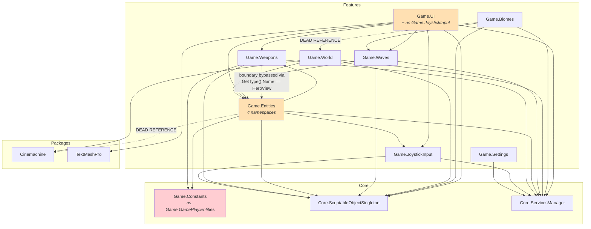
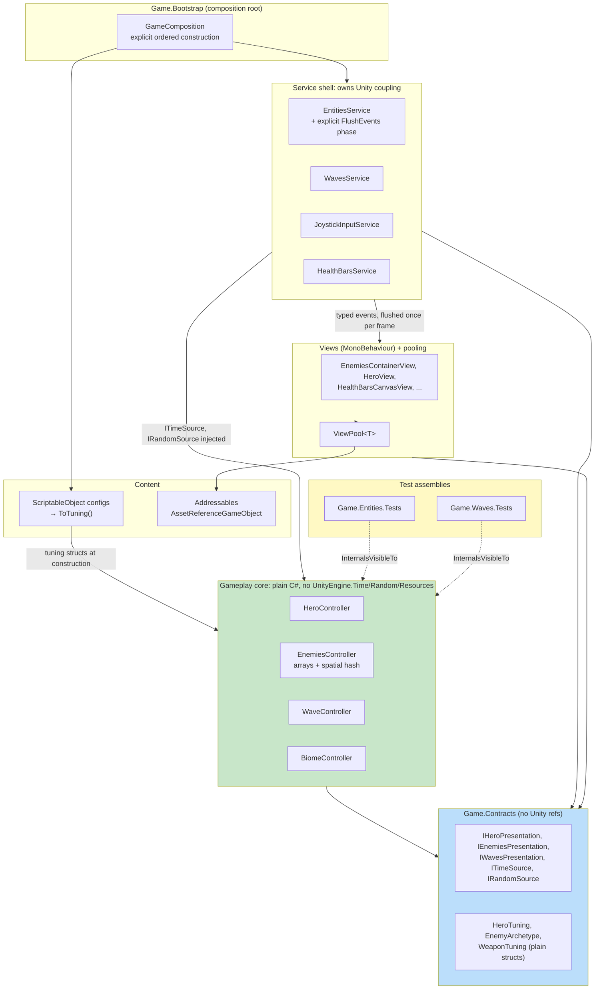

# Architecture & Code Structure Review

**Scope:** static review of the repository as it exists at review time. No source code was
modified.
**Subject:** Unity 2022.3.62f2 arena prototype, 72 C# files / 5,678 lines across 11 assemblies,
101 commits.
**Budget under review:** ~8 hours on top of an inherited base project (`README.md`, "Time and scope").

---

## How I am grading this

I am separating three different judgements, because collapsing them produces a useless review:

1. **Was this the right call for 8 hours?** Most of the shortcuts here pass this test, and I
   say so explicitly where they do.
2. **Is the claim in the docs true?** This is graded strictly. A wrong document is worse than
   no document, because it is load-bearing for the next engineer.
3. **Would this survive 12 months and 5 engineers?** This is where the real findings are.

**Calibration note on severity:** I found **zero Critical issues**. Nothing in this codebase
crashes, corrupts state, or fails in normal play. For an 8-hour build that is genuinely to its
credit and I am not going to manufacture a Critical to look rigorous. The problems are
structural and they are about the *next* 12 months, not this build. Severity here means
"how expensive is this to unwind later", not "how broken is it now".

---

## Prioritized findings

| Severity | Area | Finding | Evidence (file:line) | Recommendation |
|---|---|---|---|---|
| ~~High~~ **Resolved** | Correctness / Docs | Hero targeting took the **first** enemy in dictionary order, not the nearest, while four documents claimed "nearest". **Fixed in `b875b53` after this review**: now selects minimum distance with a lower-ID tie-break, and the docs were corrected to match. | Was `HeroController.cs:137-151`; now `:137-164`. Claims at `docs/codebase-map.md:7`, `docs/index.md:5,16` now accurate. | Done. |
| High | Testability | Every gameplay controller is `internal sealed` and there is **no `InternalsVisibleTo` anywhere in the repo**. A test assembly literally cannot see them. | `HeroController.cs:13`, `EnemiesController.cs:11`, `WaveController.cs:11`, `HealthBarsCanvasController.cs:10`, `BiomeController.cs:8`; zero `InternalsVisibleTo` matches repo-wide | Add `[assembly: InternalsVisibleTo("Game.Entities.Tests")]` per feature asmdef. ~30 min. |
| High | Boundaries | Plain-C# controllers reach into a `Resources.Load`-backed `ScriptableObject` static singleton. This is the single change that makes them un-unit-testable. | `HeroController.cs:73,113,203`; `HealthBarsCanvasController.cs:38,83`; `EntitiesService.cs:217` | Pass a config snapshot (`readonly struct HeroTuning`) into the constructor. |
| High | Boundaries | `Game.Weapons` deliberately does not reference `Game.Entities`, then defeats the boundary at runtime with a **string type-name comparison** and `GetComponentInParent<MonoBehaviour>()`. | `Assets/Features/Weapons/Scripts/View/WeaponPickupView.cs:64-65`; asmdef at `Game.Weapons.asmdef:5-11` | Introduce an `IWeaponPickupTarget` marker in a shared contracts assembly. |
| High | Process | Only CI workflow builds Doxygen. No compile check, no test run, no player build. | `.github/workflows/documentation.yml` (only file in `.github/workflows/`) | Add a Unity compile + EditMode test job. Highest ROI item in the repo. |
| ~~High~~ **Resolved** | Determinism | The determinism claim was only half true: enemy→hero was sorted by ID, hero→enemy targeting was not. **Fixed in `b875b53`**: target selection is now the lexicographic minimum of `(distance, enemyId)`, so it no longer depends on collection ordering. | `EnemiesController.cs:166-173` (sorted) and `HeroController.cs:137-164` (min-select with tie-break) | Done. |
| Medium | Architecture | Service discovery calls `GetTypes()` on **every** loaded assembly and instantiates via `Activator.CreateInstance`, with IL2CPP managed stripping enabled and **no `link.xml` in the repo**. | `ServicesLocator.cs:98-122`, `:73`; `ProjectSettings/ProjectSettings.asset:841` (`managedStrippingLevel: 1`); no `link.xml` repo-wide | Filter to `Game.*`/`Core.*` assemblies, or move to explicit registration in a composition root. |
| Medium | Architecture | Relative tick order of the four independent `PlayerLoopTiming.Update` loops is decided by `Dictionary` enumeration order seeded by reflection assembly order. | `EntitiesService.cs:139-189`, `WavesService.cs:89-113`, `JoystickInputService.cs:52-60`, `HealthBarsService.cs:80-88`; ordering source at `ServicesLocator.cs:130` | One driver loop, or explicit `int Order` on `IService`. |
| Medium | Architecture | Locator is keyed by **concrete type** (`_services.TryGetValue(typeof(T))`), so nothing can be resolved or substituted by interface. | `ServicesLocator.cs:197-209`; every call site e.g. `EntitiesService.cs:44-48` | Register against interfaces; keeps the API and unblocks fakes. |
| Medium | Architecture | If any `Initialize` returns false, the loop returns early, `_isInitialized` stays false, `OnAllServicesInitialized` never fires, and **every view silently stays unwired** behind one console error. | `ServicesLocator.cs:86-96` | Fail loud: throw, or continue and report a per-service failure list. |
| Medium | Performance | Enemy separation is O(n²) × 2 passes with a `Mathf.Sqrt` per overlapping pair, every frame. | `EnemiesController.cs:300-348` (loops at `:313`, `:315`; sqrt at `:328`; `SeparationPasses = 2` at `:14`) | Uniform spatial hash. Not yet needed: cap is 20 (`Assets/Resources/WavesConfig.asset:18`). |
| Medium | Performance | `HealthBarsCanvasController.Tick` allocates a `List<KeyValuePair<int,float>>` **every frame** purely to iterate while mutating. | `HealthBarsCanvasController.cs:173` | Reuse a member buffer, or collect removals into a reusable `List<int>`. |
| Medium | Structure | `Assets/Core/Constants/` (assembly `Game.Constants`, `rootNamespace: Game`) declares `namespace Game.GamePlay.Entities`. Folder, assembly and namespace all disagree. | `Assets/Core/Constants/Scripts/Constants.cs:1`; `Game.Constants.asmdef:2-4` | Move to `Game.Constants` namespace, or move the folder into `Features/Entities`. |
| Medium | Structure | `JoystickView.cs` lives in the UI folder, compiles into `Game.UI`, and declares `namespace Game.JoystickInput`. | `Assets/Features/UI/Scripts/View/JoystickView.cs:8` | Move the file into `Features/JoystickInput`, or rename the namespace. |
| Medium | Structure | Two dead assembly references widen the build graph for nothing. | `Game.Biomes.asmdef:7` → `Game.World` (no Biomes file references it); `Game.Entities.asmdef:6` → Cinemachine (no Entities file uses it) | Delete both references. 5 minutes. |
| Medium | Performance | Per-entity `MonoBehaviour.Update` on every enemy, hit-flash and pickup view. | `EnemyView.cs:59-78`, `HitFlashView.cs:61`, `WeaponPickupView.cs:38-43` | Drive from the container view's single `Update`. |
| Medium | Content | Arena bounds are a compile-time `const`, duplicated at six call sites, while the arena *visual* is a swappable biome prefab. | `Constants.cs:42`; used at `HeroController.cs:236,241`, `EntitiesService.cs:98,103`, `WeaponsService.cs:106,107`; biome swap at `BiomeContainerView.cs:37` | Move to `WorldConfig`. A designer cannot resize the arena today without a code change. |
| Medium | Content | Addressables is installed and three weapon prefabs + an atlas are marked addressable, but **no C# file uses the Addressables API**. The same prefabs are also hard-referenced from a `Resources/`-loaded config, so they ship twice. | `Packages/manifest.json:6`; `Assets/AddressableAssetsData/AssetGroups/Default Local Group.asset` (4 entries); hard ref at `Assets/Features/Weapons/View/Local/GreatSword/GreatSword.asset:22` | Either remove the addressable flags or actually load through them. |
| Medium | Robustness | Reusable internal buffers are returned to callers as `IReadOnlyList` and then iterated across reentrant event dispatch. | `EnemiesController.cs:20` (`_dashHits`), `:195` (returns `_attacks`), `:261-262` (`ClearAll` clears both); iterated at `EntitiesService.cs:174-186`, `:219-222` | Document the aliasing contract or copy on return. Latent, not currently reachable. |
| Low | Robustness | Duplicate locator destroys itself in `Awake`, then its `OnDestroy` dereferences a null `_orderedServices`. | `ServicesLocator.cs:52-56` vs `:211-227` (`:216`) | Null-guard `ResetServices`. Only reachable on scene reload, which this project never does. |
| Low | Docs | `docs/codebase-map.md:69` claims no collider path exists. The weapon pickup path is entirely collider/trigger based. | `WeaponPickupView.cs:6,58-70`; trigger capsule at `Assets/Features/Entities/View/Heroes/Alice/Alice.prefab:552` | Correct the map. |
| Low | Docs | `EnemyHitResult` XML documents a `damage` parameter the constructor does not have. | `Assets/Features/Entities/Scripts/Models/RuntimeState/EnemyHitResult.cs:28` vs `:33-39` | Delete the stale tag. Doxygen CI does not catch this. |
| Low | Docs | `WeaponsConfig` XML says "startup currently equips index zero"; startup actually equips `Unarmed`. | `WeaponsConfig.cs:8` vs `WeaponsService.cs:32-40` | Fix the comment. |
| ~~Low~~ **Resolved** | Docs | Four stale factual claims in `README.md`: bee speed, hero health, a shadow-flag TODO, and content selection. Three were *under*-claims describing shipped work as unfinished. **All corrected**; the profiling section now cites retained device captures. | Was `README.md` "speed 10→1" vs `BeeNormal.asset:17` (`speed: 3`); "health 10,000" vs `HeroConfig.asset:17` (`150`); TODO vs `BeeNormal.prefab:366,652` (`m_CastShadows: 0`) | Done. |
| Low | Dead code | `BiomesService.RestartGame()` is public and never called by anything. | `Assets/Features/Biomes/Scripts/BiomesService.cs:30` | Delete. |
| Low | Dead code | `HealthBarState.Matches` is never called; the controller republishes unconditionally every frame. | `HealthBarState.cs:44`; publishers at `HealthBarsCanvasController.cs:73,151` | Use it as a dirty check, or delete it. |
| Low | Naming | `Reset()` means "service teardown" on `IService` and "gameplay restart" on `BiomeController`. | `IService.cs` (`Reset`) vs `BiomeController.cs:39` | Rename the controller method to `RestartGame` for consistency with the other four. |
| Low | Consistency | `WeaponUsesIndicatorController` is `public sealed`; every sibling controller is `internal sealed`. It also formats a UI display string (with an em dash) inside the "no presentation" layer. | `WeaponUsesIndicatorController.cs:6`, `:13-19` | Make it `internal`; move string formatting to the view. |
| Low | Consistency | Three services return `default` from `Reset()` instead of `UniTask.CompletedTask`. | `JoystickInputService.cs:160-165`, `WorldService.cs:36`, `BiomesService.cs:43` | Trivial cleanup. |
| Low | Lifecycle | `WeaponPickupView` never unsubscribes `OnPickupRequested`; `WeaponsContainerView.Remove` destroys the view without unsubscribing. This contradicts `docs/codebase-map.md:53`. | `WeaponsContainerView.cs:40` | Unsubscribe on destroy. |

---

## 1. Structure

### 1.1 The real assembly graph

Eleven local assemblies. Every one references UniTask. Verified by resolving each
`.asmdef` GUID reference to its owning assembly name.

| Assembly | Path | Declares namespaces | References (local) |
|---|---|---|---|
| `Game.Constants` | `Assets/Core/Constants/Scripts` | `Game.GamePlay.Entities` | None |
| `Core.ScriptableObjectSingleton` | `Assets/Core/ScriptableObjectSingleton/Scripts` | `Core.ScriptableObjectSingleton` | None |
| `Core.ServicesManager` | `Assets/Core/ServicesManager/Scripts` | `Core.ServicesManager` | None |
| `Game.Settings` | `Assets/Features/Settings/Scripts` | `Game.Settings` | `Core.ServicesManager` |
| `Game.JoystickInput` | `Assets/Features/JoystickInput/Scripts` | `Game.JoystickInput` | SOSingleton, ServicesManager |
| `Game.Weapons` | `Assets/Features/Weapons/Scripts` | `Game.Weapons` | Constants, SOSingleton, ServicesManager |
| `Game.Entities` | `Assets/Features/Entities/Scripts` | `Game.Entities`, `Game.GamePlay.Entities`, `Game.GamePlay.Enemies`, `Game.GamePlay.Heroes` | Constants, **Cinemachine (dead)**, SOSingleton, ServicesManager, JoystickInput, Weapons |
| `Game.Waves` | `Assets/Features/Waves/Scripts` | `Game.Waves` | ServicesManager, Entities, SOSingleton |
| `Game.World` | `Assets/Features/World/Scripts` | `Game.World` | Cinemachine, Entities, SOSingleton, ServicesManager |
| `Game.Biomes` | `Assets/Features/Biomes/Scripts` | `Game.Biomes` | SOSingleton, ServicesManager, **World (dead)**, Waves |
| `Game.UI` | `Assets/Features/UI/Scripts` | `Game.UI`, **`Game.JoystickInput`** | SOSingleton, ServicesManager, Entities, JoystickInput, Waves, Weapons, TextMeshPro |

The graph is acyclic and layered correctly: `Core.*` depends on nothing local,
features depend downward, `Game.UI` is a leaf. For 8 hours that is a good result and
better than most prototypes. Three things spoil it.

### 1.2 Where physical layout and namespaces disagree

**a) `Game.Constants`: folder, assembly and namespace all disagree.**
The file lives in `Assets/Core/Constants/Scripts/Constants.cs`, compiles into an assembly
named `Game.Constants` whose `rootNamespace` is `Game` (`Game.Constants.asmdef:2-4`), and
declares `namespace Game.GamePlay.Entities` (`Constants.cs:1`). A *Core* assembly is
injecting types into a *feature* namespace. The practical consequence: `WeaponsService.cs`
must write `using Game.GamePlay.Entities;` to read `Constants.World.ArenaLimit`, so the
Weapons feature appears, on inspection of its `using` block, to depend on Entities. It does
not. That is a misleading signal in every file that touches constants.

**b) `Game.Entities` contains four namespaces in one folder tree.**
- `Game.Entities`: only two files, the presentation interfaces (`IHeroPresentationSource`, `IEnemiesPresentationSource`).
- `Game.GamePlay.Entities`: `EntitiesService.cs:1`, `EnemyAttackRequest.cs:1`, `HeroAttackRequest.cs:3`, `HitFlashView.cs:3`.
- `Game.GamePlay.Enemies`: `EnemyState.cs`, `EnemyHitResult.cs`, `EnemiesController.cs`.
- `Game.GamePlay.Heroes`: `HeroState.cs`, `HeroHitResult.cs`, `HeroDashRequest.cs`, `HeroController.cs`.

Crucially, `Models/RuntimeState/` is a **single folder split across three namespaces**.
`EnemyAttackRequest.cs` and `EnemyState.cs` are siblings on disk and in different namespaces.
The visible cost: `EntitiesService.cs:1-11` needs eleven `using` lines to talk to types
inside its own assembly. The interfaces a consumer actually binds to
(`Game.Entities.IHeroPresentationSource`) live in a namespace with two files in it, while the
implementation lives in a third. A new engineer opening `HeroView.cs` sees three `Game.*`
namespaces imported and has no way to know they are all the same assembly.

**c) `JoystickView.cs` is in the wrong feature.**
`Assets/Features/UI/Scripts/View/JoystickView.cs:8` declares `namespace Game.JoystickInput`
but compiles into `Game.UI`. Anyone doing "find all references in Game.JoystickInput" will
miss it. Anyone splitting UI into its own package will accidentally take the joystick view
with it.

### 1.3 Documented architecture vs. actual code

`docs/codebase-map.md` is unusually good for a prototype: it is specific, it names files,
and most of it is true. It is also wrong in five places, and I am grading it strictly
because it is written as authority (`AGENTS.md:30` instructs engineers to follow it).

| Claim | Location | Reality |
|---|---|---|
| "hero automatically attacks **nearest** tracked enemy inside equipped weapon range" | `docs/codebase-map.md:7`, repeated `docs/index.md:5,16` | **Was false at review time**: `HeroController.cs:137-151` returned the *first* in-range enemy in `Dictionary` enumeration order. Fixed in `b875b53`; the claim is now accurate, and the docs were tightened to specify "strictly inside range" with a lower-ID tie-break. |
| "No projectile, collider, raycast, hitbox, physical contact-point ... path exists in the inspected runtime source" | `docs/codebase-map.md:69` | Weapon pickup is entirely trigger-collider driven: `WeaponPickupView.cs:6` (`RequireComponent(Collider, Rigidbody)`), `:58` (`OnTriggerEnter`), and the hero carries a trigger `CapsuleCollider` (`Alice.prefab:552-573`). |
| Service tree listing | `docs/codebase-map.md:10-32` | Omits `SettingsService`, `WeaponUsesIndicatorService`, `GameEndAnalyticsService`. Because discovery is by reflection, this list can never be authoritative: it is a hand-maintained snapshot of an automatically-derived set, which is the worst of both. |
| "views retain publisher references and unsubscribe in `OnDestroy`" | `docs/codebase-map.md:53` | `WeaponsContainerView.cs:40` destroys a pickup view without unsubscribing `OnPickupRequested`. |
| "`Game.World` references `Game.Entities` ... entity gameplay does not depend on world presentation" | `docs/codebase-map.md:55` | True, but the map omits the two dead references (`Game.Biomes.asmdef:7`, `Game.Entities.asmdef:6`). |

At review time `README.md` also carried four stale factual claims, **all since corrected**: bee
speed (claimed "10→1"; `BeeNormal.asset:17` reads `speed: 3`), hero health (claimed `10,000`;
`HeroConfig.asset:17` reads `150`), a shadow-casting `[TODO: confirm]` for a flag that was
already off (`BeeNormal.prefab:366,652` = `m_CastShadows: 0`), and "runtime content selection
still uses the first weapon and enemy entry" when weapons already used a weighted random roll
(`WeaponsService.cs:66-95`) and enemies came from wave groups.

Three of those four were **under-claims**: the README was describing work as unfinished that had
in fact shipped. That is the more interesting failure mode, and it has the same root cause as the
over-claims: nothing verifies documentation against the assets it describes.

This is the pattern I would push back on hardest in a panel: **the documentation is
maintained by a CI job that only checks it builds** (`.github/workflows/documentation.yml`),
never that it is true. Doxygen will happily publish `EnemyHitResult.cs:28`'s parameter tag
for a parameter that does not exist.

---

## 2. Architecture

### 2.1 `ServicesLocator`: reflection discovery + topological init

**File:** `Assets/Core/ServicesManager/Scripts/ServicesLocator.cs` (229 lines).

**What it solves.** Zero-ceremony service registration. Write a class implementing `IService`,
declare its dependencies, and it exists. No wiring file to edit, no merge conflicts on a
registration list. For a solo 8-hour build with one scene, this is a real productivity win and
I would not have replaced it mid-assignment either.

**What it costs.**

*Startup and stripping.* `DiscoverServices()` (`:98-122`) walks
`AppDomain.CurrentDomain.GetAssemblies()` and calls `GetTypes()` on every one (UnityEngine,
mscorlib, the whole set) with no assembly-name filter. Services are then constructed via
`Activator.CreateInstance` (`:73`), meaning nothing in the codebase statically references
them. `ProjectSettings/ProjectSettings.asset:841` sets `managedStrippingLevel: 1` and there
is **no `link.xml` anywhere in the repo**. In the Editor this is invisible. In an IL2CPP
player build with stripping, reflection-only-referenced types are exactly the category the
linker removes. This is not currently broken because nobody has shipped a stripped build,
which is itself the finding, since there is no CI build to prove it.

*Ordering is only half-specified.* `OrderServicesByDependencies` (`:124-192`) is a DFS
topological sort over `IService.GetDependencies()`. Two problems. First, dependencies are
declared in one place (`EntitiesService.cs:36-39`) and *resolved* in another
(`EntitiesService.cs:44-48`), and nothing enforces that the two agree: a missing declaration
produces `Debug.LogWarning` (`:182`) and a circular dependency produces `Debug.LogError`
(`:153`) and then **continues with a wrong order**. Second, the seed iteration is over a
`Dictionary<Type, IService>` (`:130`), so any two services with no declared relationship are
ordered by hash-bucket order, which is seeded by reflection discovery order, which is seeded
by assembly load order.

That second point is not academic. There are four independent per-frame loops all on
`PlayerLoopTiming.Update`:

- `EntitiesService.RunLoop` (`EntitiesService.cs:139-189`)
- `WavesService.RunLoop` (`WavesService.cs:89-113`)
- `JoystickInputService.UpdateLoop` (`JoystickInputService.cs:52-60`)
- `HealthBarsService.Loop` (`HealthBarsService.cs:80-88`)

`EntitiesService` reads `_joystick.CurrentState` inside its own loop. Whether the hero
responds to this frame's input or last frame's input depends on which loop UniTask registered
first, which depends on the topological sort's tie-breaking, which depends on assembly load
order. It currently works. Nothing guarantees it keeps working after someone adds a service.

*Resolution is by concrete type.* `GetService<T>` does `_services.TryGetValue(typeof(T))`
(`:197-209`). You cannot register an interface and swap the implementation. Combined with
discovery-by-reflection, this actively blocks testing: a test double implementing `IService`
would itself be auto-discovered and instantiated globally.

*Failure is silent.* `Initialize` returns early on the first `false` (`:86-96`), so
`_isInitialized` never flips and `OnAllServicesInitialized` never fires. The observable
symptom is a completely inert game with one console line. There is no per-service status
surface.

**What it gets right, and I want this on the record.** The `OnAllServicesInitialized` event
uses explicit `add`/`remove` accessors (`:33-48`) that invoke a late subscriber immediately.
That single design choice removes all `Awake`/`Start` ordering anxiety from the ~15 views in
the project. It is the cleanest idea in the infrastructure and it is exactly the right
solution to Unity's initialization-order problem.

**Where it breaks down.** Second scene, second engineer, or first stripped build, whichever
comes first.

### 2.2 `IService` lifecycle

`Initialize` / `Reset` / `GetDependencies`. The shape is right and the discipline is real:
every service creates a `CancellationTokenSource`, runs its loop, and cancels on `Reset`
(e.g. `EntitiesService.cs:129-137`, `HealthBarsService.cs:52-78`). That is better hygiene
than most prototypes.

Two frictions. First, `Reset` collides semantically with gameplay restart: `IService.Reset`
means teardown, but `BiomeController.Reset` (`BiomeController.cs:39`) means gameplay restart,
and there are separately `WavesService.RestartGame`, `EntitiesService.RestartGame`,
`BiomesService.RestartGame` (dead), `WeaponsService.Restart(float)` and
`HeroController.Restart()`. Five spellings of "restart" plus one overloaded `Reset` is a
genuine comprehension tax. Second, teardown is fire-and-forget: `OnDestroy` calls
`ResetServices().Forget()` (`:211`), so Unity may finish tearing down the domain before the
awaited resets complete.

### 2.3 `ScriptableObjectSingleton<T>`: config access

**File:** `Assets/Core/ScriptableObjectSingleton/Scripts/ScriptableObjectSingleton.cs` (40 lines).

`Instance` lazily does `Resources.Load<T>(typeof(T).Name)` (`:26`). Three costs:

1. **Name-by-convention coupling.** Renaming the C# class silently breaks the asset lookup at
   runtime, producing `Debug.LogError` (`:30`) and a null return. No compile-time signal, no
   editor validation.
2. **Never-cleared static cache** (`:12`). Currently latent (`ProjectSettings/EditorSettings.asset:25`
   has `m_EnterPlayModeOptionsEnabled: 0`), but
   `m_EnterPlayModeOptions: 3` is already staged, so the first person who turns off domain
   reload to speed up iteration inherits a stale-config bug.
3. **`Resources/` is force-loaded and unpatchable.** Six configs live in `Assets/Resources/`.
   That folder is loaded whole into the build, cannot be excluded, and cannot be replaced
   live-ops style. It also transitively drags in every prefab those configs reference:
   `HeroConfig.HeroPrefab`, `EnemyConfig.Prefab`, `WeaponConfig.Prefab`, `BiomeConfig.prefab`.

**This is the most consequential decision in the codebase**, and not because of the loading
mechanism. It is because `Instance` is *ambient*: any code, anywhere, at any layer, can reach
config without declaring that it does. Which is exactly what happened.

### 2.4 Boundary audit: is gameplay actually isolated from Unity?

`AGENTS.md:33-36` states that gameplay decisions live in plain C# and that "no controller,
including a UI controller, may depend on views, UI components, animation, audio, camera,
particles, or other presentation objects."

**That specific rule is upheld.** I checked: no controller holds a view reference. Good.

**But the rule is written too narrowly to deliver the isolation it implies.** It does not
mention config, `Time`, or `Random`, and all three leak.

**Leak 1: static config from inside controllers (the important one).**

- `HeroController.cs:73`: `HeroConfig.Instance.MoveSpeed`
- `HeroController.cs:113`: `HeroConfig.Instance.DashDistance`
- `HeroController.cs:203`: `HeroConfig.Instance.InitialHealth`
- `HealthBarsCanvasController.cs:38, :83`: `HeroConfig.Instance.InitialHealth`
- `EntitiesService.cs:217`: `HeroConfig.Instance.DashHitRadius`
- `HealthBarsCanvasView.cs:46`: `WavesConfig.Instance.MaximumConcurrentEnemies`

`HealthBarsCanvasController` is the sharpest illustration. It is a *UI* controller in the
`Game.UI` assembly reaching across into the *Entities* feature's config, at two separate call
sites, for one number: max hero health. And it only has to do that because
`HeroHitResult` (`HeroHitResult.cs:6-32`) does not carry max health, while
`EnemyHitResult.cs:17-18` **does** carry `MaximumHealth`. The two hit-result contracts were
designed inconsistently, and the UI layer pays for it by importing a gameplay singleton.
Adding one field to `HeroHitResult` deletes the leak entirely.

`HealthBarsCanvasView.cs:46` is worse in kind if smaller in impact: a Unity *view* reads
gameplay wave configuration to pick a dictionary capacity.

**Leak 2: `UnityEngine.Random`.** `EntitiesService.cs:94` (enemy spawn angle),
`WeaponsService.cs:80,103,104` (weighted pickup roll, radius, angle). This is global mutable
static state with no seed injection. There is no deterministic replay, no reproducible bug
report, and no way to write a test asserting "given seed 42, three enemies spawn here".

**Leak 3: `UnityEngine.Time` in services.** `EntitiesService.cs:69,145,150,172`;
`WavesService.cs:37,57,97,115,117`; `WeaponsService.cs:36`;
`JoystickInputService.cs:91,94,116,118`; `HealthBarsService.cs:85,96`.

**Here is the credit, and it matters:** the leak stops at the service layer.
`HeroController.Tick(joystick, weapon, currentTime, deltaTime)` (`HeroController.cs:40`),
`EnemiesController.Tick(hero, deltaTime, enemySpacing)` (`EnemiesController.cs:110`) and
`WaveController`'s entire API (`WaveController.cs:31,41,60,84`) take time as an explicit
parameter. Whoever wrote this understood the seam and put it in the right place. Services are
the impure shell; controllers are the pure core. That is the correct architecture, executed
about 80% of the way, and the remaining 20% is `HeroConfig.Instance`.

**Not a leak:** `Mathf` and `Vector3` in controllers (`HeroController.cs:171,234-243`,
`EnemiesController.cs:75,220,328`). These are pure value math with no engine state. Calling
them a boundary violation would be dogma. I would keep them.

**Leak 4: presentation types inside authoritative gameplay state.** `EnemyState` (a struct)
holds an `EnemyConfig` reference (`EnemyState.cs:18`), and `EnemyConfig` holds
`EnemyView Prefab` (`EnemyConfig.cs:56`). So the authoritative gameplay state graph reaches a
`MonoBehaviour` prefab in two hops. Nothing dereferences it from gameplay code today, but the
type graph does not enforce the rule the docs state.

### 2.5 The controller / service / view split, and typed events

The split is real and consistently applied. Services own Unity coupling and lifetime;
controllers own decisions; views subscribe to typed events and never poll gameplay. The event
payloads are self-sufficient immutable snapshots (`EnemyHitResult`, `HeroHitResult`,
`WaveState`, `HealthBarState`) rather than "something changed, go look" notifications. That is
a considered choice and a good one.

Three costs of raw C# events, all visible in the code:

1. **No ordering guarantee between subscribers.** `EnemiesController.TryApplyDamage` fires
   `OnEnemyHit` (`:99`) then `OnEnemyRemoved` (`:103`), and it removes the state at `:87`,
   *before* both. So a subscriber handling `OnEnemyHit` for a lethal enemy will find that
   `CurrentStates` no longer contains it. That trap is documented in prose
   (`docs/codebase-map.md:66`) and signalled only by an `IsLethal` bool on the payload.
2. **Deep synchronous reentrancy.** A single dash can, inside one `foreach` in
   `EntitiesService.cs:219-222`, kill an enemy → fire `OnEnemyRemoved` → `WavesService` →
   `WaveController.Publish` → `BiomesService` → `BiomeController.Consume` →
   `BiomeContainerView.OnBiomeChanged` → `Destroy` and `Instantiate` an entire arena prefab.
   That is a scene-graph mutation executing inside a damage loop. It works. It is not
   something anyone would design on purpose.
3. **Buffer aliasing.** `CollectAttackRequests` returns the internal reusable `_attacks` list
   (`EnemiesController.cs:195`) and `CollectDashHitEnemyIds` returns `_dashHits` (`:20`).
   `ClearAll` clears both (`:261-262`). `EntitiesService` iterates those returned lists while
   dispatching events (`:174-186`, `:219-222`). If any subscriber ever reaches `ClearAll`
   (and `EntitiesService.RestartGame` does exactly that at `:67`), the `foreach` throws
   `InvalidOperationException`. It is not reachable today only because restart requires a
   button click. This is a landmine with a documented-nowhere safety catch.

**The buffer reuse itself is good.** `_ids`, `_updated`, `_attacks`, `_dashHits`
(`EnemiesController.cs:17-20`) are allocated once and cleared per frame. That is deliberate
zero-allocation work and it should be credited, not punished. It just needs a copy-on-return
or an explicit "do not retain" contract.

### 2.6 Testability

**Infrastructure status:** `com.unity.test-framework: 1.1.33` is installed
(`Packages/manifest.json:15`). There are **zero test files and zero test assembly
definitions** in the repository. `README.md` ("Code quality", "With more time") says tests would be added as the project
scales. Two things block that today, and one of them is a one-line fix.

**Blocker A: visibility.** Every controller is `internal sealed` (`HeroController.cs:13`,
`EnemiesController.cs:11`, `WaveController.cs:11`, `HealthBarsCanvasController.cs:10`,
`AutoAttackIndicatorController.cs:7`, `BiomeController.cs:8`) and there is no
`InternalsVisibleTo` attribute anywhere in the repo. A test assembly cannot name the types.
`internal` was the right call for encapsulation; it just needs the companion attribute.

**Blocker B: ambient statics.** `HeroConfig.Instance` in `HeroController` and
`HealthBarsCanvasController`; `ServicesLocator.Instance`, `Time.time` and `UnityEngine.Random`
in every service.

**Blocker C: fixture construction.** Even for a pure controller, building test data is hard.
`EnemyConfig` exposes only getters over `[SerializeField]` privates (`EnemyConfig.cs:10-56`),
so an EditMode test must use `ScriptableObject.CreateInstance` plus `SerializedObject` or
reflection just to make a bee with 30 HP. A `[Serializable]` plain-C# tuning struct with an
internal constructor would remove this entirely.

**What is unit-testable today with no scene** (given only the `InternalsVisibleTo` fix):

| Class | Status | Why |
|---|---|---|
| `BiomeController` | **Fully testable** | Constructor injection, no statics, no Unity types beyond data (`BiomeController.cs:17`). |
| `AutoAttackIndicatorController` | **Fully testable** | No statics; all timing passed in. |
| `WaveController` | Testable, awkward fixtures | Pure; takes `IReadOnlyList<WaveDefinition>` and explicit time (`WaveController.cs:31`). Blocked only by Blocker C. |
| `EnemiesController` | Testable, awkward fixtures | Pure math + injected `deltaTime` (`:110`). Blocked only by Blocker C. |
| `GameEndStats` | Fully testable | Pure struct (`GameEndAnalyticsService.cs:61-88`). |
| `WeaponUsesIndicatorController` | Testable | Needs a `WeaponConfig` instance. |
| `HeroController` | **Blocked** | `HeroConfig.Instance` at `:73,:113,:203`. In EditMode `Resources.Load` succeeds, so tests would silently couple to shipped tuning values, which is worse than failing. |
| `HealthBarsCanvasController` | **Blocked** | `HeroConfig.Instance` at `:38,:83`. |
| All `IService` implementations | **Blocked** | `ServicesLocator.Instance`, `Time.time`, `UnityEngine.Random`. |

So: two classes are testable as-is, four more after a 30-minute unblock, and the two most
behaviour-dense classes need a config-injection refactor first. That is a much better
position than most prototypes: the seams exist, they are just not opened.

---

## 3. Readability

### 3.1 End-to-end trace: input → dash → damage → UI → death

I walked it. A new engineer can get through it, but there are eight specific places they will
stall. Numbered hops, with the stall points called out.

1. **`JoystickInputService.HandleInput`** (`JoystickInputService.cs:62`) polls
   `Input.touchCount` / mouse.
2. Second press inside `SecondTapWindow` sets `JoystickInputMode.Secondary`
   (`JoystickInputService.cs:100`).
3. Release above `SecondaryMinimumInputMagnitude` fires
   `OnSecondaryInputReleased?.Invoke(...)` (`JoystickInputService.cs:111`).

   > **Stall 1.** The word "dash" appears **nowhere** in `Game.JoystickInput`. An engineer
   > grepping `dash` to find where dashing starts will never reach the input layer. The
   > abstraction is deliberate (`docs/codebase-map.md:59` explains it) and defensible, but it
   > means the entry point is discoverable only by reading a document.

4. **`EntitiesService.OnSecondaryInputReleased`** (`EntitiesService.cs:191`) sets
   `_hasPendingDash` and `_pendingDashDirection`.

   > **Stall 2.** The dash is not executed here. It is queued and consumed on the *next*
   > frame by `TryResolvePendingDash` (`EntitiesService.cs:152, 197`). That one-frame latency
   > is invisible and uncommented.

5. **`EntitiesService.RunLoop`** (`EntitiesService.cs:139-189`). The frame order is:
   `Time.time` snapshot (`:145`) → `_hero.Tick` (`:146`) → `TryResolvePendingDash` (`:152`) →
   `_weapons.Tick` (`:153`) → hero auto-attack only if no dash committed (`:155-166`) →
   `_enemies.CollectAttackRequests` (`:168`) → `_enemies.Tick` (`:172`) → apply enemy attacks
   (`:174-186`).

   > **Stall 3.** Enemy attack eligibility is collected at `:168` **before** enemies move at
   > `:172`, so attacks resolve against last frame's positions. That is a real design decision
   > with gameplay consequences, and the only place it is written down is
   > `docs/codebase-map.md:60-67`. `RunLoop` itself carries no comment explaining why the
   > order is what it is. This is the clearest case in the codebase of **documentation
   > carrying weight the code structure should carry**: the fix is not more comments, it is
   > named phase methods (`AdvanceInput` / `ResolveHeroActions` / `ResolveEnemyActions` /
   > `ApplyDamage`).

6. **`HeroController.TryCreateDashRequest`** (`HeroController.cs:98`) computes the endpoint
   and calls `SetPosition` (`:113`), which fires `OnHeroPositionChanged`, and only then
   constructs and fires `OnDashPerformed` (`:115`).

   > **Stall 4.** The position event fires *before* the dash event. `HeroView` relies on this
   > (`HeroView.cs:164`) to draw the trail correctly. Swap the two lines and the visual breaks
   > with no compile error.

   > **Stall 5.** `HeroController.cs:72` and `:111` build the world direction as
   > `new Vector3(-input.x, 0f, -input.y)`, and `HeroView.cs:151,164,195` then negate again
   > (`-targetDirection`, `-dash.Direction`). A double sign flip with no comment anywhere. An
   > engineer changing camera orientation will spend an hour here.

   > **Stall 6.** `HeroDashRequest` is not a request. By the time it is constructed the hero
   > has already moved (`:113` precedes `:115`). Meanwhile `HeroAttackRequest` and
   > `EnemyAttackRequest` genuinely *are* requests that can be rejected. "Request" means two
   > opposite things in the same folder.

7. **`EntitiesService.TryResolvePendingDash`** (`:215`) calls
   `_enemies.CollectDashHitEnemyIds(dash, HeroConfig.Instance.DashHitRadius)`, then at `:221`
   applies `TryApplyDamage(id, int.MaxValue, out _)`.

   > **Stall 7.** `int.MaxValue` is an undocumented magic sentinel meaning "instant kill". It
   > is not a named constant, and `Constants.cs`, which exists for exactly this, does not
   > contain it.

   > Also note the hit radius is fetched from a static singleton *inside the service*, not
   > carried on the `HeroDashRequest`, so the request is not self-describing.

8. **`EnemiesController.TryApplyDamage`** (`:66-107`) removes state (`:87`), fires
   `OnEnemyHit` (`:99`), then `OnEnemyRemoved` (`:103`).
9. **Presentation fans out**: `EnemiesContainerView.OnEnemyHit` (`:80`) plays death;
   `OnEnemyRemoved` (`:55`) schedules `Destroy(go, 1f)` (`:63`).

   > **Stall 8.** That `1f` is `EnemyDeathAnimationDuration` (`EnemiesContainerView.cs:17`), a
   > C# constant that must match the length of an animation clip it has no reference to. Retime
   > the clip and enemies either vanish mid-animation or linger. Nothing links the two.

10. **UI**: `HealthBarsService.OnHit` (`:96`) → `HealthBarsCanvasController.ApplyEnemyHit`,
    which early-returns on lethal (`:103`); `WavesService.OnEnemyRemoved` (`:117`) →
    `WaveController.RemoveEnemy` → possibly `Publish` (`:219-230`) → `BiomesService` →
    `BiomeController.Consume` → `BiomeContainerView` destroys and instantiates the arena:
    **all synchronously inside step 8's event dispatch.**
11. **Death**: `_hero.TakeHit` (`EntitiesService.cs:182`) → `OnHeroHit` →
    `GameEndOverlayView.OnHeroHit` (`:65`) → `ShowGameOver()`.
12. **Restart**: `GameEndOverlayView.OnRestartButtonClicked` (`:140`) →
    `WavesService.RestartGame` (`:50-59`) → then `EntitiesService.RestartGame` (`:59`).

    > The comment at `WavesService.cs:46-49` documents that wave reset **must** precede entity
    > clear, otherwise stale removal events advance the fresh run. That is a genuine
    > correctness invariant whose only enforcement is a comment and a call order. It is
    > exactly the kind of thing that gets broken by a refactor six months from now.

**Verdict:** a competent engineer can trace this in an afternoon *with* `docs/codebase-map.md`
open. Without it, steps 3, 5 and 12 are not derivable from the code.

### 3.2 Naming: inconsistent, misleading, duplicated

- **"Request" means two things.** `HeroDashRequest` is a committed fact
  (`HeroController.cs:113-115`); `HeroAttackRequest` / `EnemyAttackRequest` are proposals.
- **"Reset" means two things.** `IService.Reset` is teardown; `BiomeController.Reset`
  (`:39`) is gameplay restart.
- **Five spellings of restart:** `WavesService.RestartGame`, `EntitiesService.RestartGame`,
  `BiomesService.RestartGame` (dead, `BiomesService.cs:30`), `WeaponsService.Restart(float)`,
  `HeroController.Restart()`.
- **Three spellings of clear:** `EnemiesController.ClearAll(bool resetIds)`,
  `EnemiesController.ClearPresentationSubscribers()`, `HealthBarsCanvasController.Clear()`.
- **Namespace names that describe nothing:** `Game.Entities` holds two interfaces;
  `Game.GamePlay.Entities` holds the service, two request models and a view; there is no rule
  a newcomer can infer for which of the four Entities namespaces a new file belongs in.
- **One controller is `public`** (`WeaponUsesIndicatorController.cs:6`) while all five siblings
  are `internal`. There is no reason for it: nothing outside `Game.UI` references it.

### 3.3 Implicit ordering and hidden coupling

Collected in one place, because this is the category that will cost the most later:

| Hidden dependency | Where it lives | Enforced by |
|---|---|---|
| Relative order of 4 per-frame loops | `ServicesLocator.cs:130` (dictionary order) | Nothing |
| Enemy attacks resolve against pre-move positions | `EntitiesService.cs:168` before `:172` | A doc line |
| Position event must precede dash event | `HeroController.cs:113` before `:115` | Nothing |
| Wave reset must precede entity clear on restart | `WavesService.cs:46-59` | A comment |
| `OnEnemyHit` fires after state removal on lethal | `EnemiesController.cs:87,99,103` | `IsLethal` flag + doc |
| Death-view lifetime must match an animation clip | `EnemiesContainerView.cs:17` | Nothing |
| Pickup detection depends on component order in the hero prefab | `WeaponPickupView.cs:64` | Nothing |
| Single-outstanding-spawn-request invariant | `WaveController.cs:21,61,69-74` | Nothing |
| Config asset filename must equal C# type name | `ScriptableObjectSingleton.cs:26` | Nothing (runtime error only) |

### 3.4 Where XML docs carry weight the structure should carry

The XML documentation in this project is unusually thorough and it is doing real work, which
is the problem. It has become the load-bearing member.

- `EntitiesService.RunLoop` (`:139-189`) encodes a seven-step ordering contract with **no**
  inline explanation; the rationale lives only at `docs/codebase-map.md:60-67`. Named phase
  methods would encode it in the type system.
- `IEnemiesPresentationSource.OnEnemyRemoved`'s doc says "presentation may defer visual
  cleanup": the actual 1-second deferral is a magic const in a view
  (`EnemiesContainerView.cs:17`).
- The docs are not verified. `EnemyHitResult.cs:28` documents a `damage` parameter that does
  not exist in the constructor (`:33-39`). `WeaponsConfig.cs:8` says startup "equips index
  zero" while `WeaponsService.cs:32-40` equips `Unarmed`. Doxygen publishes both without
  complaint (`.github/workflows/documentation.yml`).

---

## 4. Scalability

I will answer the question directly: **the axis that breaks first is engineers-in-parallel,
not enemies-on-screen.** The enemy cap is 20 (`WavesConfig.asset:18,24,32`), and at 20 the
O(n²) pass is ~380 comparisons, so nothing. Meanwhile there is one scene file, no tests, and no
CI compile check *today*.

### Axis 1: More enemies (100s to 1000s)

**First symptom: GPU frame time, not CPU, and this is already measured, not predicted.**
The project stress-tested to 200 bees and found the frame decisively GPU-bound:
`CPU 25.59 ms` against `GPU 62.77 ms` across 428 draw calls, with the CPU spending most of the
frame parked in `Gfx.WaitForPresentOnGfxThread` (`docs/performance.md` §2). That is not a
borderline reading: the GPU is doing roughly 2.5× the CPU's work, so the CPU is idling on it.

**The mechanism is identified, which is the part that matters.** Each bee is a skinned mesh
dispatched through Unity's `Internal-Skinning` compute shader at **6007 vertices**, 94 thread
groups, once per bee per frame, captured in the Frame Debugger, not inferred. Each is also
instantiated individually (`EnemiesContainerView.cs:50`) with no pooling, no GPU instancing and
no LOD. The cost is in *drawing* bees, not in creating them.

I want to be explicit that this is the strongest engineering work in the submission, because it
is the part most candidates skip: the baseline was healthy (`11.08 ms` at 20 bees), so the
author deliberately scaled past the shipped configuration to find the breaking point, then
identified the specific GPU stage responsible rather than stopping at "the GPU is busy". Every
optimization decision downstream (including the decision *not* to pool) follows from that
measurement instead of from intuition.

**Second symptom, once rendering is fixed: main-thread spikes in `EntitiesService.RunLoop`.**
Three compounding costs:

1. `ResolveSpacing` (`EnemiesController.cs:300-348`) is O(n²) × `SeparationPasses = 2` (`:14`),
   with a `Mathf.Sqrt` per overlapping pair (`:328`). 20 → ~380 pair tests. 200 → ~40,000.
   1,000 → ~1,000,000 pair tests per frame.
2. `Tick` rebuilds and sorts the id list every frame (`:117-123`) and `CollectAttackRequests`
   sorts it **again** (`:166-173`): two O(n log n) sorts per frame, purely for determinism.
3. Every enemy carries its own `MonoBehaviour.Update` with a `Quaternion.Slerp` and a read of
   hero presentation state (`EnemyView.cs:59-78`), plus a second `Update` on `HitFlashView`
   (`:61`). At 1,000 enemies that is 2,000 managed↔native transitions per frame before any
   work happens.

**What is well-built here and would survive:** the reusable buffers (`EnemiesController.cs:17-20`)
mean the per-frame allocation rate for enemies is genuinely zero, and `EnemyState` is a struct
so the "rebuild on mutation" pattern (`:91,206,291-297,331-344`) costs copies, not GC. That is
an important distinction: the immutable-state pattern is a *cache* problem here, not an
*allocation* problem. The cache problem is real though: `EnemyState.Config` is a reference to
a `ScriptableObject` (`EnemyState.cs:18`), so reading `Speed` or `AttackRange` in the movement
loop is a pointer chase out of the hot array into managed heap objects scattered by the asset
loader.

**Actual per-frame GC in the current build:** `HealthBarsCanvasController.cs:173` allocates a
`List<KeyValuePair<int,float>>` every frame, sized by visible bars. That is the one real
allocation in the steady-state loop.

### Axis 2: More entity types, weapons, abilities

**First symptom: `EntitiesService` becomes a merge-conflict hotspot.** `RunLoop`
(`:139-189`) is a hand-written fixed sequence of hero-then-weapons-then-enemies. There is no
concept of an "ability" or an "entity behaviour": adding a ranged enemy means editing the
same 50 lines that every other feature edits. `WeaponConfig` (`:10-45`) has fixed fields
(`damage`, `range`, `cooldown`, `maxUses`); a weapon with an area effect or a projectile has
nowhere to live except new fields on the same class and new branches in the same loop.

**Second symptom:** the dash path bypasses weapon data entirely and hardcodes
`int.MaxValue` damage (`EntitiesService.cs:221`) with radius from a global singleton (`:217`).
A second dash-like ability has no shared abstraction to reuse.

### Axis 3: More features, more engineers in parallel

**This breaks first in practice, and it breaks immediately.**

- **One scene.** `Assets/Scenes/MainScene.unity` (89 GameObjects) contains the services
  object, the whole UI canvas and the camera. Every feature branch that touches UI edits this
  file. Unity scene YAML merges badly. Two engineers, one week.
- **No compile CI.** `.github/workflows/documentation.yml` is the only workflow, and it builds
  Doxygen. Nothing verifies the project compiles, let alone runs. A broken merge is discovered
  by the next person to open the editor.
- **No tests.** Zero test assemblies. Every regression is caught by manual play, which
  `README.md` ("Code quality") acknowledges.
- **Global auto-registration.** Any new `IService` in any assembly is instantiated globally
  with no opt-out and no scoping (`ServicesLocator.cs:98-122`). Two teams cannot have
  independent service graphs, and no one can add a service without affecting startup for
  everyone.
- **Ambient config.** Because `Config.Instance` works from anywhere, there is no
  architectural pressure preventing the next engineer from reaching across features, and
  `HealthBarsCanvasController.cs:38` shows that pressure has already failed once.

### Axis 4: Content growth and live-ops tuning

**First symptom: a designer asks to resize the arena and needs a programmer.**
`Constants.World.ArenaLimit = 14.3f` (`Constants.cs:42`) is a compile-time constant duplicated
at six call sites (`HeroController.cs:236,241`, `EntitiesService.cs:98,103`,
`WeaponsService.cs:106,107`), while the arena *visual* is a swappable per-wave biome prefab
(`BiomeConfig.asset:16-30`, swapped at `BiomeContainerView.cs:37`). Gameplay bounds and visual
bounds are maintained in two different systems.

**Second symptom: config cannot be varied or patched.** `ScriptableObjectSingleton` permits
exactly one asset per type, named after the type, in `Resources/`
(`ScriptableObjectSingleton.cs:26`). No variants, no A/B, no remote override, no per-platform
tuning. `Resources/` ships whole and drags every referenced prefab with it.

**Third symptom: build size.** Addressables 1.22.3 is installed
(`Packages/manifest.json:6`) and four assets are marked addressable
(`AddressableAssetsData/AssetGroups/Default Local Group.asset`), but **no C# file references
`Addressables` or `AssetReference`**. Meanwhile `GreatSword.asset:22` hard-references the same
`GreatSword.prefab` GUID that the addressable group owns, so the prefab is pulled into the
`Resources` dependency set *and* built into a bundle. The `View/Local` vs `View/Remote` folder
split (Weapons, Enemies) signals an intended remote-content design that no code implements.

### Axis 5: Longer sessions, scene loading, memory

**First symptom: instantiate/destroy churn.** No pooling anywhere:
`EnemiesContainerView.cs:50,63,67` (enemy prefabs), `HealthBarsCanvasView.cs:84,113` (bars),
`HeroView.cs:224,239` (weapon views on every weapon change),
`WeaponsContainerView.cs:28,40` (pickups every 5s per `WeaponsConfig.asset`). At 20 enemies
this is not the bottleneck and `README.md` says so correctly. At 200 with waves cycling it
is sustained GC pressure and hitching.

**Second symptom: scene loading is untested and will break.** `ServicesLocator` calls
`DontDestroyOnLoad(gameObject)` (`:59`) and `WorldService` does the same (`:24`), but views
live in the scene. `ServicesLocator.Instance` is never nulled in `OnDestroy`, and the
duplicate-instance guard (`:52-56`) leads to a null-deref in `ResetServices` (`:216`) for the
destroyed duplicate. The single-scene design has never exercised any of this.

**Third symptom: heap allocation from `WaveState`.** `WaveState` is a `sealed class`
(`WaveState.cs:4`), and `WaveController.Publish` (`:219-230`) constructs a new one on every
accepted spawn, every rejected spawn and every enemy removal (`:84,97,114`). At 20 enemies
that is a few dozen small allocations per wave: irrelevant. At 1,000 enemies with continuous
churn it is a steady allocation stream. `HealthBarState` is correctly a `readonly struct`
(`HealthBarState.cs`); `WaveState` and `BiomeState` are not. Inconsistent, and the
inconsistency is on the hotter path.

---

## 5. Alternatives and improvements

### 5.1 Composition root vs. reflection service locator

**What.** Replace `DiscoverServices()` (`ServicesLocator.cs:98-122`) with an explicit
`GameComposition` class in a new `Game.Bootstrap` assembly that constructs services in
declared order and passes dependencies through constructors. Keep `ServicesLocator` as a thin
read-only façade for views (`GetService<T>` stays), but register **against interfaces**
(`IEntitiesPresentation`, `IWavesPresentation`) rather than concrete types.

**Why better.** (a) Kills the `GetTypes()`-over-every-assembly startup scan and the IL2CPP
stripping exposure: types become statically referenced. (b) Makes initialization order a
readable, diffable, reviewable list instead of an emergent property of dictionary hashing.
(c) Removes the declare-in-one-place / resolve-in-another split that `GetDependencies()`
creates (`EntitiesService.cs:36-39` vs `:44-48`). (d) Unblocks test doubles: today a fake
`IService` would be auto-discovered and instantiated globally.

**Cost.** ~1 day. Low risk; mechanical. 10 services, one new file, one deleted method.

**Trigger.** Do it **before the first IL2CPP player build**, or the moment a second scene
exists. Do not do it for its own sake at 8 hours.

**Cheaper interim (30 min).** Filter discovery to assemblies whose name starts with `Game.` or
`Core.`, and add a `link.xml` preserving them. Removes the two worst symptoms without touching
the design.

---

### 5.2 Injected config vs. static singleton access

**What.** Define plain, immutable tuning structs (`readonly struct HeroTuning`,
`readonly struct WeaponTuning`) in the gameplay assemblies. Have `HeroConfig` (a
`ScriptableObject`) expose `ToTuning()`. Pass the struct into `HeroController`'s constructor.
Delete the six `Config.Instance` reads at `HeroController.cs:73,113,203`,
`HealthBarsCanvasController.cs:38,83`, `EntitiesService.cs:217`. Separately, add
`MaximumHealth` to `HeroHitResult` (mirroring `EnemyHitResult.cs:17-18`), which by itself
deletes the UI→gameplay-config dependency at `HealthBarsCanvasController.cs:38,83`.

**Why better.** This is the single change with the highest testability return in the
codebase. It converts `HeroController` and `HealthBarsCanvasController` from
"needs a Unity runtime and a `Resources` folder" to "plain NUnit". It also removes the
ambient-access loophole that `AGENTS.md:33-36` does not currently close, and it makes the
`Game.UI` → `HeroConfig` cross-feature reach a compile error rather than a convention
violation.

**Cost.** ~3 hours. Low risk: no behaviour change, purely moving reads to construction time.
The `HeroHitResult` field alone is 20 minutes.

**Trigger.** Do the `HeroHitResult` field **now**; it is nearly free and fixes a genuine
contract inconsistency. Do the full tuning-struct extraction the day you write the first unit
test.

---

### 5.3 Data and update layout for entities

**What.** Move `EnemiesController` from `Dictionary<int, EnemyState>` with per-mutation struct
rebuild (`EnemiesController.cs:16, 91, 206, 291-297, 331-344`) to parallel arrays:
`Vector3[] positions`, `float[] healths`, `int[] ids`, `byte[] archetypeIndex`, plus a
`Dictionary<int,int> idToSlot` and swap-back removal. Hoist per-archetype tuning
(`speed`, `attackRange`, `attackCooldown`) out of the `EnemyConfig` reference on
`EnemyState.cs:18` into a small `EnemyArchetype[]` value array indexed by `archetypeIndex`.
Stage two, only if measurement demands it: `IJobParallelFor` over the movement and separation
passes with Burst.

**Why better.** Three wins, in order of size. (1) It removes the pointer chase from the hot
loop: today reading `state.Config.Speed` (`EnemiesController.cs:288`) dereferences a managed
`ScriptableObject` per enemy per frame. (2) It removes the two per-frame `Sort()` calls
(`:117-123`, `:166-173`), because array index order *is* stable order: determinism becomes
free rather than O(n log n). (3) It is a precondition for jobs/Burst; you cannot job a
`Dictionary<int, struct-with-managed-ref>`.

**Why not full DOTS/ECS.** For a project of this size, converting to Entities 1.x means
rewriting every view, the whole presentation event model and the service layer. The
array-of-structs step gets ~80% of the throughput for ~10% of the disruption, and it keeps
`EnemiesController` a plain testable C# class. I would explicitly *not* recommend ECS here.

**Cost.** Arrays: ~1 day, medium risk (touches the highest-traffic file). Jobs+Burst: another
~2 days, and it forces `Vector3`→`float3` and removes `Mathf` from the hot path.

**Trigger.** When sustained concurrent enemies exceed **~150**, or when profiling shows
`EnemiesController.Tick` above ~2 ms. Not before: at the current cap of 20
(`WavesConfig.asset:18`) this would be pure waste.

---

### 5.4 Spatial partitioning vs. the O(n²) separation pass

**What.** Replace the nested loops in `ResolveSpacing` (`EnemiesController.cs:300-348`,
loops at `:313`/`:315`) with a uniform spatial hash: a `Dictionary<long, List<int>>` or, better
once §5.3 lands, a bucket-count array plus a sorted index array. Cell size = `enemySpacing`
(currently 2, `WavesConfig.asset:19`). Each enemy tests only its own cell and the 8 neighbours.
Also replace `Mathf.Sqrt` at `:328` with a squared-distance comparison and only take the root
for the overlapping minority. Reuse the same grid for `HeroController.TryCreateAttackRequest`
(`:137-164`) and `CollectDashHitEnemyIds`, all three of which are currently linear or quadratic
scans.

**Why better.** O(n·k) instead of O(n²), where k is average occupancy per cell (bounded by
physical crowding, ~4-8). At 1,000 enemies that is ~8,000 tests instead of ~1,000,000, per
pass. The arena is fixed-size (`Constants.cs:42`) and enemies are uniformly distributed around
the hero, so a uniform grid is the right structure: no quadtree needed.

**Cost.** ~4 hours standalone, or ~2 hours if done together with §5.3. Medium risk: separation
is visually load-bearing and a bug here shows up as jitter.

**Trigger.** When concurrent enemies exceed **~150**. Be honest about the ordering though:
the project's own device profiling shows that at 200 enemies you are **GPU-bound**
(`CPU 25.59 ms` vs `GPU 62.77 ms`, `docs/performance.md` §2), so fixing the separation pass
first would produce a measurably identical frame time. Rendering (§5.6) comes first; this comes
second. The profiling already establishes that ordering: it does not need re-deriving.

---

### 5.5 Event contracts: raw events vs. bus vs. command queue

**What.** Keep typed C# events: they are the right primitive and they compile-time-check the
payload, which a string-keyed message bus does not. But add an **explicit publish/flush step**
inside the gameplay tick. Concretely: controllers append to a per-frame
`List<GameplayEvent>` (a discriminated struct, or separate typed lists), and
`EntitiesService.RunLoop` (`:139-189`) gains an explicit `FlushEvents()` phase at the end that
dispatches in a defined order. Presentation subscribes to the flush, not to the mutation.

**Why better.** It fixes three concrete problems that exist today:

1. **Reentrancy.** Today a dash kill synchronously reaches
   `BiomeContainerView.OnBiomeChanged` (`:37`) and instantiates an arena prefab from inside
   a damage `foreach` (`EntitiesService.cs:219-222`). With a flush, gameplay completes before
   any presentation runs.
2. **Buffer aliasing.** `CollectAttackRequests` returning the internal `_attacks` list
   (`EnemiesController.cs:195`) while `ClearAll` (`:261`) can clear it mid-iteration stops
   being a landmine, because nothing dispatches during the collect phase.
3. **Ordering.** The `OnEnemyHit`-after-removal trap (`:87,99,103`) becomes an explicit,
   readable dispatch order in one place instead of a prose note at
   `docs/codebase-map.md:66`.

Determinism follows for free: a flushed queue can be recorded and replayed, which is how you
get reproducible bug reports.

**Why not a message bus.** A `Publish<T>(T msg)` bus buys decoupling this project does not
need (10 services, all known) and costs compile-time traceability: "who handles this?"
becomes a runtime question. Given `docs/codebase-map.md` already struggles to stay accurate, I
would not add a mechanism that makes the call graph less greppable.

**Cost.** ~1 day. Medium risk: it changes when presentation observes state, so animation
timing needs re-verification.

**Trigger.** When the second gameplay system starts mutating state from inside an event
handler, or the first time someone hits an `InvalidOperationException` from a modified
collection. Also do it if determinism/replay ever becomes a requirement.

---

### 5.6 View lifetime, pooling, and the content pipeline

**What.**

- **Pooling.** Introduce a generic `ViewPool<T> where T : MonoBehaviour` and use it in
  `EnemiesContainerView` (`:50,63,67`), `HealthBarsCanvasView` (`:84,113`),
  `WeaponsContainerView` (`:28,40`) and `HeroView`'s weapon swap (`:224,239`). Pair it with
  the deferred-destroy path (`EnemiesContainerView.cs:17`): return to pool after the death
  animation rather than `Destroy`.
- **Kill per-entity `Update`.** Move `EnemyView.Update` (`:59-78`) and `HitFlashView.Update`
  (`:61`) into a single loop in `EnemiesContainerView`, or a `TransformAccessArray` +
  `IJobParallelForTransform` for the facing Slerp.
- **Content.** Either commit to Addressables: replace `EnemyConfig.Prefab`
  (`EnemyConfig.cs:56`), `WeaponConfig.Prefab` (`:45`) and `HeroConfig.HeroPrefab` (`:31`)
  with `AssetReferenceGameObject`, load per-wave, release on wave end, or remove the four
  addressable flags and the `Local`/`Remote` folder split, which currently advertise a design
  that does not exist. Today the weapon prefabs are duplicated across the `Resources`
  dependency set and the addressable bundle (`GreatSword.asset:22` vs the addressable group
  entry).

**Why better.** Pooling removes the sustained instantiate/destroy GC churn that appears as
frame hitches on long sessions. Removing per-entity `Update` removes n managed↔native
transitions per frame, which is typically the single largest CPU win in Unity crowd scenarios.
Addressables removes prefabs from the always-resident set and makes content patchable without
a client rebuild.

**Cost.** Pooling: ~4 hours, low risk. Update consolidation: ~3 hours, low risk. Addressables
migration: ~2 days, medium risk (loading becomes async, which changes service init).

**Trigger.** Pooling and `Update` consolidation: when concurrent entities exceed **~100**, or
the first reported hitch. Addressables: when build size or patch cadence becomes a business
requirement, not before, because async loading complicates a currently-synchronous init path.

---

### 5.7 Testing strategy: ordered by confidence-per-hour

| # | Target | Why first | Effort |
|---|---|---|---|
| 0 | `[assembly: InternalsVisibleTo(...)]` in each feature asmdef | Nothing else is possible without it | 30 min |
| 1 | `WaveController` (`WaveController.cs:31-115`) | Highest logic density per line in the project: spawn request/confirm/reject handshake, wave advance, restart. Fully deterministic: takes `IReadOnlyList<WaveDefinition>` and explicit time. The single-outstanding-request invariant (`:21,61,69-74`) is exactly the kind of thing that breaks silently. | 3 h |
| 2 | `EnemiesController` damage + lethality (`:66-107`) | Covers the event-ordering trap (state removed at `:87` before `OnEnemyHit` at `:99`) that every presentation subscriber depends on. | 3 h |
| 3 | `HeroController` targeting and cooldown (`:123-170`) | Requires §5.2 first. This is the class where the nearest-vs-first bug lived; a test would have caught it immediately, and would now lock in the tie-break behaviour so it cannot silently regress. | 2 h + refactor |
| 4 | `EnemiesController.ResolveSpacing` (`:300-348`) | Characterization test *before* the spatial-hash rewrite, so the optimization is provably behaviour-preserving. | 2 h |
| 5 | `BiomeController` + `AutoAttackIndicatorController` | Free: testable today with zero changes. Good first PR for a new hire. | 1 h |
| 6 | PlayMode smoke test: boot scene, assert `ServicesLocator` reports initialized | Catches the silent total-failure mode at `ServicesLocator.cs:86-96`, which today produces one console line and an inert game. | 2 h |

Explicitly **not** worth testing early: views. They are thin, they are visual, and the
assertions would be brittle.

**Trigger.** Item 0 and item 5 are worth doing at any team size above one. Items 1 to 2 the day a
second engineer joins.

---

### 5.8 Tooling and CI

**What.** Add `.github/workflows/ci.yml` with three jobs:

1. **Compile check**: `game-ci/unity-builder` or `unity-test-runner` in `EditMode`, which
   compiles every assembly. This alone catches the majority of merge breakage.
2. **EditMode tests**: once §5.7 exists.
3. **IL2CPP player build** on `main`: the only thing that will catch the
   reflection-vs-managed-stripping exposure (`ServicesLocator.cs:73,98-122` +
   `ProjectSettings.asset:841`, no `link.xml`).

Plus two cheap static checks: a script asserting each `.asmdef`'s declared references are
actually used (catches `Game.Biomes.asmdef:7` and `Game.Entities.asmdef:6` automatically), and
a Doxygen warnings-as-errors flag on the existing docs job (catches
`EnemyHitResult.cs:28`'s phantom parameter).

**Why better.** Today `.github/workflows/documentation.yml` is the *only* workflow. A PR that
does not compile can be merged. For a project whose stated plan is "add tests as it scales"
(`README.md`, "With more time"), the harness must exist before the tests do.

**Cost.** ~4 hours for the compile job (Unity licensing in CI is the fiddly part). ~2 hours
for the rest.

**Trigger.** **Now.** This is the highest-value item in this entire document and the only one
I would argue should have been in the 8 hours: a compile-check workflow is 30 lines of YAML.

---

### 5.9 Proposed target architecture

The important structural differences from today: config flows **downward from the composition
root** instead of being pulled ambiently from anywhere; `Time` and `Random` are injected
interfaces so the domain layer is deterministic; a `Game.Contracts` assembly gives
`Game.Weapons` a legitimate way to identify the hero instead of `GetType().Name == "HeroView"`
(`WeaponPickupView.cs:65`); and presentation observes a single flushed event batch rather than
reentrant mutation callbacks.

---

## 6. What I'd do differently with 40 hours

**Shortcuts that were correct at 8 hours, and I would keep:**

1. **Not building pooling, and proving it rather than asserting it.** The author profiled on
   device, found the frame GPU-bound at 200 bees (`CPU 25.59 ms` vs `GPU 62.77 ms`), identified
   the per-bee skinned-mesh dispatch as the cost, and *then* took memory snapshots showing
   spawn/death cost only `9.7 KB` / `19.3 KB` GC, confirming lifecycle was not the bottleneck
   instead of assuming it (`docs/performance.md` §2, §6). That is the right process and the
   right conclusion. Optimizing an unmeasured path would have been the actual mistake, and it is
   the mistake the obvious-looking "add pooling" instinct would have produced.
2. **Keeping the O(n²) separation pass.** At `maximumConcurrentEnemies: 20`
   (`WavesConfig.asset:18`), a spatial hash is strictly worse: more code, more bugs,
   identical frame time.
3. **Keeping the inherited `ServicesLocator`.** Swapping the DI mechanism mid-assignment
   would have consumed a quarter of the budget and produced zero visible game feel. Correct
   call.
4. **Immutable snapshot event payloads.** `EnemyHitResult`, `WaveState`, `HealthBarState`
   carry everything a subscriber needs. That is a deliberate design choice that scales, and it
   cost nothing extra to make.
5. **Time as a parameter on controllers.** `HeroController.Tick(..., currentTime, deltaTime)`
   (`:40`) and `WaveController`'s explicit-time API (`:31`). This is the single best
   architectural decision in the project: it costs nothing today and it is the seam that makes
   everything testable later. Whoever did this knew what they were doing.
6. **`internal sealed` controllers.** Correct encapsulation. It just needs one attribute.
7. **Reusing existing animation clips and the inherited art.** Zero budget spent on assets.

**What I would change about the *process* even at 8 hours:** add the compile-check CI workflow
(30 lines of YAML, ~30 minutes), and export the profiler screenshots at capture time rather than
reconstructing the evidence afterwards. The measurements were sound; the record of them was not
kept alongside them, which cost more time to reassemble later than exporting would have cost in
the moment. A review panel checks exactly that link between claim and evidence.

**With 40 hours, the shape would be:**

- **Hours 1 to 4: composition root + CI.** Explicit service construction, interface-keyed
  registration, `InternalsVisibleTo`, and a GitHub Actions compile job. This is the
  foundation everything else stands on and it is cheap.
- **Hours 5 to 8: config injection.** Tuning structs passed at construction. Delete all six
  `Config.Instance` reads from controllers and services. Add `MaximumHealth` to
  `HeroHitResult` so the UI stops reaching into gameplay config.
- **Hours 9 to 16: tests.** `WaveController`, `EnemiesController`, `HeroController`, plus a
  PlayMode boot smoke test. This is where the nearest-enemy bug would have died months earlier
  than it did, along with three others I probably have not found.
- **Hours 17 to 22: explicit event flush.** A `FlushEvents` phase at the end of
  `EntitiesService.RunLoop`, killing the reentrancy chain and the buffer-aliasing landmine,
  and making dispatch order explicit instead of documented.
- **Hours 23 to 30: structure cleanup.** Collapse the four `Game.Entities` namespaces into two
  (`Game.Entities` for contracts, `Game.Entities.Internal` for implementation). Move
  `Constants.cs` and `JoystickView.cs` to the assemblies whose names they wear. Delete the two
  dead asmdef references. Add a `Game.Contracts` assembly so `WeaponPickupView.cs:64-65` can
  stop comparing type names as strings. Move `ArenaLimit` into `WorldConfig`.
- **Hours 31 to 36: performance headroom.** Pooling for enemies, bars and pickups. Consolidate
  per-entity `Update` into the container. Only *then*, if 200+ enemies is a target, the array
  layout and spatial hash.
- **Hours 37 to 40: documentation truth pass.** Delete every claim in
  `docs/codebase-map.md` and `README.md` that the code contradicts. The "nearest enemy" claim
  (four documents) has since been made true by fixing the code rather than the docs, which was
  the right call; what remains is "no collider path exists" (`:69`) and the stale tuning numbers.
  Turn the service list at `:10-32` into something generated, or delete it, because a
  hand-maintained list of a reflection-derived set will always rot.

**The opinionated summary:** this codebase's problem is not that it made bad choices under
time pressure. It made mostly good ones. Its problem is that it has **no mechanism that makes
a wrong claim fail**: no tests, no compile CI, no doc verification. The nearest-enemy bug is the
proof: it survived four documents asserting the opposite behaviour and a README asserting
determinism the code did not have, and it was caught only because a human read the loop line by
line. It has since been fixed (`b875b53`), but nothing in the repository would have stopped it
coming back. Every finding above is downstream of that one absence.

---

## Top 5 things I'd fix first, in order

> The original #2 on this list, hero targeting selecting the first in-range enemy rather than the
> nearest, was fixed in `b875b53` while this review was being written. It has been struck and the
> list re-ordered.

1. **Add a CI compile check.** `.github/workflows/documentation.yml` is the only workflow and
   it builds Doxygen. Nothing verifies the project compiles. ~30 lines of YAML, ~4 hours with
   Unity licensing. Every other item on this list is safer once this exists, and it is the
   mechanism whose absence let the nearest-enemy bug live.

2. **Add `InternalsVisibleTo` and write the first three tests.** Every controller is
   `internal sealed` with no test access anywhere in the repo. Add the attribute per feature
   asmdef, then test `WaveController` (`:31-115`) and `EnemiesController.TryApplyDamage`
   (`:66-107`), the two highest-logic-density, already-pure classes. ~4 hours for real
   regression coverage of the spawn handshake and the lethality event ordering.

3. **Inject config instead of reaching for `HeroConfig.Instance`.** Six call sites:
   `HeroController.cs:73,113,227`, `HealthBarsCanvasController.cs:38,83`,
   `EntitiesService.cs:217`. Start with the free win: add `MaximumHealth` to `HeroHitResult`
   (mirroring `EnemyHitResult.cs:17-18`), which alone deletes the UI-controller-reaches-into-
   gameplay-config violation. ~3 hours total, and it unblocks testing `HeroController`.

4. **Constrain service discovery, or replace it.** `ServicesLocator.cs:98-122` calls
   `GetTypes()` on every loaded assembly and constructs via `Activator.CreateInstance` (`:73`)
   with managed stripping on (`ProjectSettings.asset:841`) and no `link.xml`. The 30-minute
   version: filter to `Game.*`/`Core.*` and add a `link.xml`. The right version: an explicit
   composition root, which also fixes the undefined tick ordering between the four
   `PlayerLoopTiming.Update` loops (`ServicesLocator.cs:130`). Do the 30-minute version before
   the first player build; do the real one before the second scene.

5. **Delete the stringly-typed hero check.** `WeaponPickupView.cs:65` does
   `hero.GetType().Name == "HeroView"` after a `GetComponentInParent<MonoBehaviour>()`, to avoid
   an assembly reference from `Game.Weapons` to `Game.Entities`. It breaks silently on rename and
   picks an arbitrary first `MonoBehaviour`. Introduce a small `Game.Contracts` assembly with an
   `IWeaponPickupTarget` marker interface and check for that instead. ~2 hours, and it is the
   precedent that stops the next boundary from being bypassed the same way.

