# Performance: profiling, measurements, and what changed

Supporting evidence for the [README](../README.md#performance-and-profiling) performance summary.
Every number here comes from a capture on a real device. Every screenshot links to its full size
version.

**Short version:** the game sits comfortably inside budget at its shipped scale, the bottleneck under
load is GPU rendering rather than gameplay CPU, and the one optimization I shipped came from an idea
that profiling proved wrong.

---

## Method

| | |
|---|---|
| **Device** | Pixel 7, Android **Development Build** |
| **Tools** | Profile Analyzer (median frame data), Profiler (CPU and GPU split, hierarchy), Frame Debugger (draw calls, batches, triangles), Memory Profiler (allocation snapshots) |
| **Capture rate** | **90 FPS**, the device limit, set deliberately above the shipped 60 FPS target. See the note below. |
| **Shipped target** | 60 FPS |
| **Sample size** | 299 to 300 frame captures. **Median** reported throughout, not mean. |

Median rather than mean matters here. Several captures include scene load spikes that drag the mean
far above the steady state. Where a capture has those spikes, I say so.

**Why 90 and not 60.** The first captures I took on device looked wrong. The GPU appeared to be
idling and the frame times were suspiciously flat, which is not what 200 skinned meshes should look
like. The cause was the frame rate cap: Unity was limiting the frame rate, so the device finished
early and waited, and the profiler was faithfully recording the wait instead of the work. Raising
`Application.targetFrameRate` to the device limit of 90 removed the ceiling and the real cost
appeared. Everything in this document was captured that way, above the shipped target on purpose, so
that waiting on the frame rate cannot hide CPU or GPU time.

The useful part was not the fix, it was not trusting the first result. A flat, cheap looking profile
is usually a measurement problem rather than good news.

**Everything except the bees was disabled for every capture.** This is a controlled comparison, not a
whole game frame budget. UI, added feedback and unrelated gameplay systems were switched off and the
enemy count was pinned, so that the only thing changing between runs is the variable under test. That
is what makes the deltas in section 3 meaningful: `+2.44 ms`, `+2.76 ms` and `+1.32 ms` are
attributable to the ground marker itself, not to whatever else happened to be on screen at the time.

Enemy separation is one of the systems that was not running, so nothing here measures it. Where it
appears below it is a projection from the algorithm, clearly marked as such. The CPU figures in
section 2 are also mostly the main thread waiting on the GPU rather than doing gameplay work, which
is what being GPU bound means.

The trade off is that the added feedback does not have a separately measured cost of its own. The one
piece of added feedback with a plausible per frame cost is the ground marker, and that is exactly
what section 3 measures. The rest is cheap by construction: no particle systems, no audio, health
bars as UI elements on a single canvas, the hit flash as a material property change, the camera shake
as a transform offset. A capture of the full stack would most likely have confirmed a null result,
and it would have cost the hours that went into building the features.

---

## 1. Baseline: is there a problem at all?

At the configured cap of **20 concurrent bees**, no.

| Metric | Value |
|---|---:|
| Median frame time | **`11.08 ms`** |
| Mean | `11.07 ms` |
| Min / Max | `9.98 ms` / `12.12 ms` |
| Frames sampled | 299 |
| CPU main thread | `10.87 ms` |
| **GPU** | **`20.32 ms`** |
| Draw calls / batches | 58 / 47 |
| Triangles | 47.05k |

A tight spread with no outliers, so a healthy steady state, well inside the 60 FPS budget.

**But look at the CPU and GPU split.** GPU time is already about double CPU time at the shipped
scale. Nothing is wrong yet, but that ratio is the first sign that if anything breaks under load it
will be the render path, not gameplay logic. That shaped the rest of the investigation.

<b>Captures:</b> Profile Analyzer and Profiler at 20 bees

[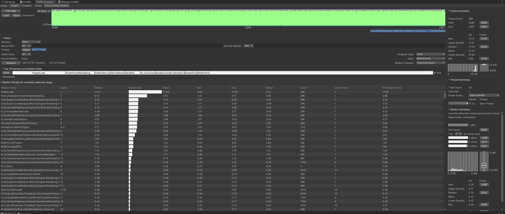](images/01-baseline-20bees-profile-analyzer.png)

*Profile Analyzer, 299 frames, median `11.08 ms`, min `9.98`, max `12.12`.*

[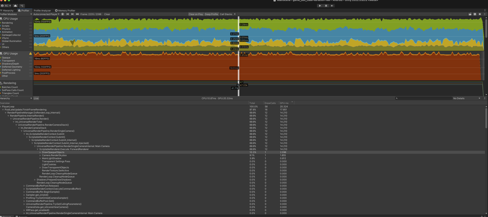](images/02-baseline-20bees-profiler-hierarchy.png)

*Profiler, same capture range. `CPU 10.87 ms` against `GPU 20.32 ms`, 58 draw calls, 47 batches.*

---

## 2. Stress test: where does it break, and why?

Scaling to **200 bees** confirmed it. The frame is **GPU bound** by a wide margin.

| Configuration | CPU | GPU | Draw calls |
|---|---:|---:|---:|
| 200 bees, realtime shadows | `21.76 ms` | **`44.67 ms`** | 427 |
| 200 bees, ground marker pass | `25.59 ms` | **`62.77 ms`** | 428 |

The CPU spends most of its frame in `Gfx.WaitForPresentOnGfxThread`, which means it is waiting on the
GPU. Any CPU side optimization here would have changed nothing.

**Where the per bee cost comes from.** Each bee is a skinned mesh going through the
`Internal-Skinning` compute shader at **6007 vertices**, 94 thread groups, once per bee per frame.
That is what instancing, an LOD, or an impostor would attack. It is also why pooling was never going
to help: the expense is in drawing bees, not in creating and destroying them.

<b>Captures:</b> GPU bound frames and per bee skinning cost

[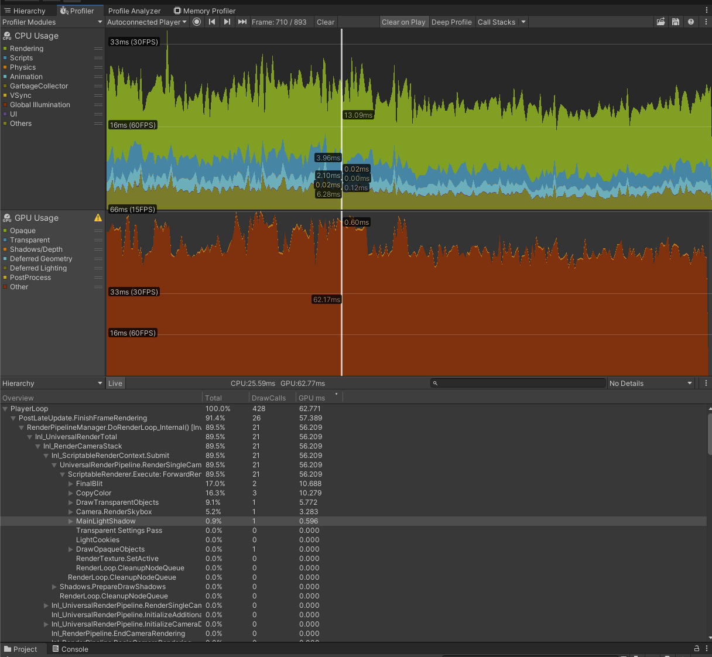](images/10-200bees-gpu-bound-marker-pass.png)

*`CPU 25.59 ms` against `GPU 62.77 ms` across 428 draw calls.*

[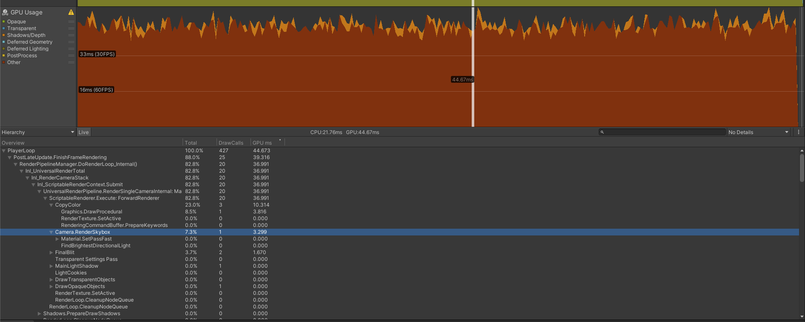](images/09-200bees-gpu-bound-shadows-on.png)

*The same picture with realtime shadows: `CPU 21.76 ms` against `GPU 44.67 ms`.*

[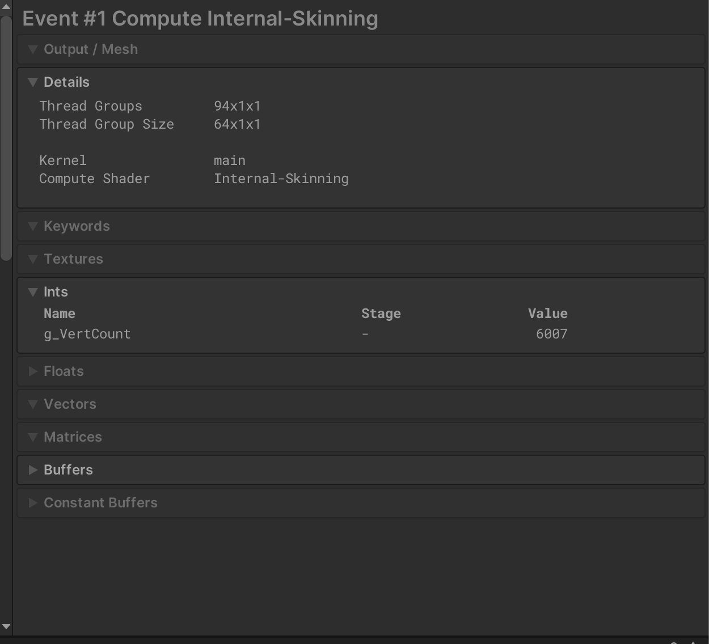](images/11-frame-debugger-gpu-skinning.png)

*Per bee GPU skinning. `g_VertCount 6007`, 94 thread groups, one dispatch per bee.*

---

## 3. The experiment, and the idea I got wrong

Bees need visible ground contact or they read as floating. Realtime shadows give that but cost shadow
casting geometry. **My idea:** replace realtime shadows with a cheap transparent blob sprite and save
about half the shadow casting triangle cost.

I profiled four configurations at 200 bees, 299 frames each, under the same conditions.

| # | Configuration | Median | vs no marker | Capture |
|---|---|---:|---:|---|
| 1 | Shadows **off**, no ground marker | `17.11 ms` | | [view](images/03-200bees-no-marker-profile-analyzer.png) |
| 2 | Realtime bee shadows **on** | `19.55 ms` | `+2.44 ms` | [view](images/04-200bees-realtime-shadows-profile-analyzer.png) |
| 3 | **Transparent blob** marker | `19.87 ms` | `+2.76 ms` | [view](images/05-200bees-transparent-blob-profile-analyzer.png) |
| 4 | **Opaque 16 triangle disk**, shadows off (shipped) | **`18.43 ms`** | **`+1.32 ms`** | [view](images/06-200bees-opaque-disk-profile-analyzer.png) |

**The idea was wrong.** The transparent blob (`19.87 ms`) came out worse than the realtime shadows it
was meant to replace (`19.55 ms`). Alpha blending with `SrcAlpha / OneMinusSrcAlpha` means every
overlapping blob costs fill rate, and in a swarm the blobs overlap constantly. The triangle saving
was real. The overdraw cost more than the saving.

**What I shipped instead:** a 16 triangle **opaque** disk with realtime bee shadows disabled.
`18.43 ms`, so `+1.32 ms` over having no ground marker at all, but cheaper than both alternatives
while keeping ground contact. Opaque means no blending, so overlap is resolved by the depth buffer
instead of costing fill rate.

<b>Captures:</b> all four configurations

[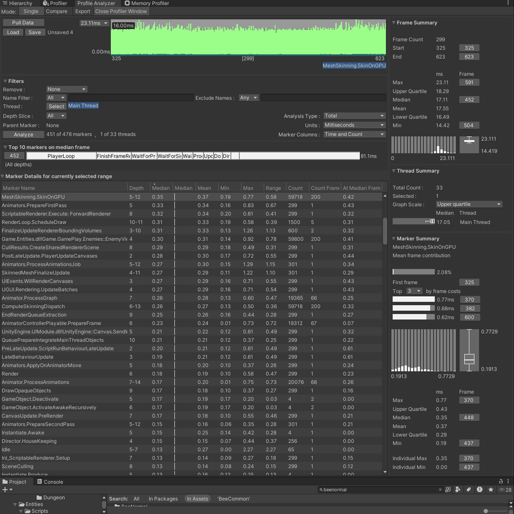](images/03-200bees-no-marker-profile-analyzer.png)

*Reference point, no marker and shadows off: median `17.11 ms`. The marker table also confirms the
scale, since `MeshSkinning.SkinOnGPU` runs at **Count Frame 200**.*

[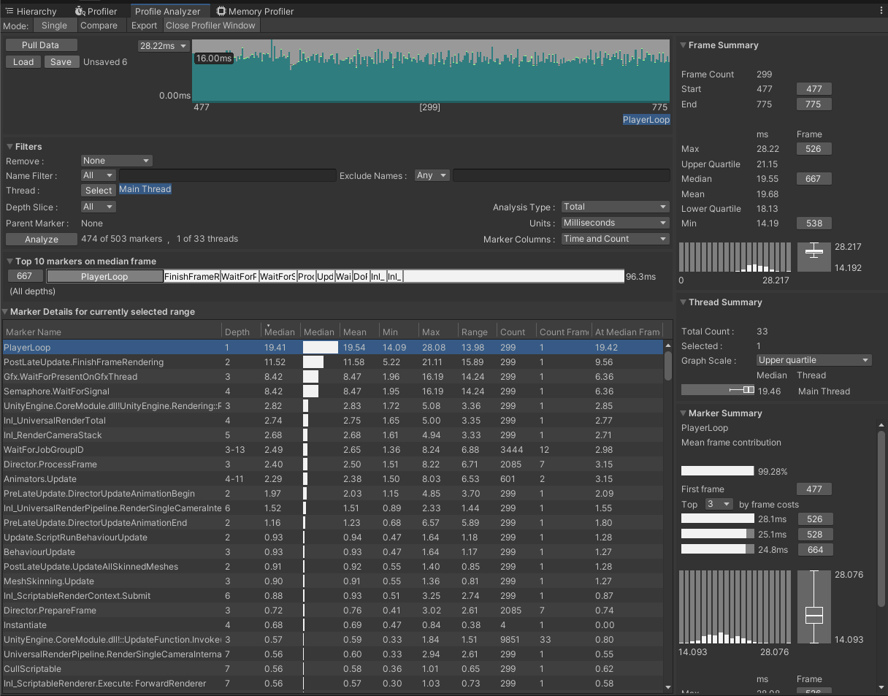](images/04-200bees-realtime-shadows-profile-analyzer.png)

*Realtime bee shadows: median `19.55 ms`.*

[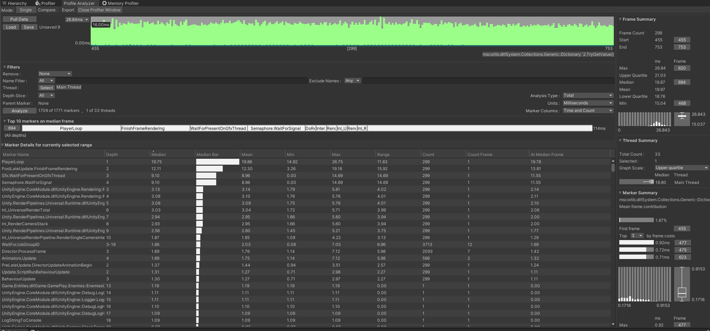](images/05-200bees-transparent-blob-profile-analyzer.png)

*The transparent blob: median `19.87 ms`, worse than the shadows it replaced.*

[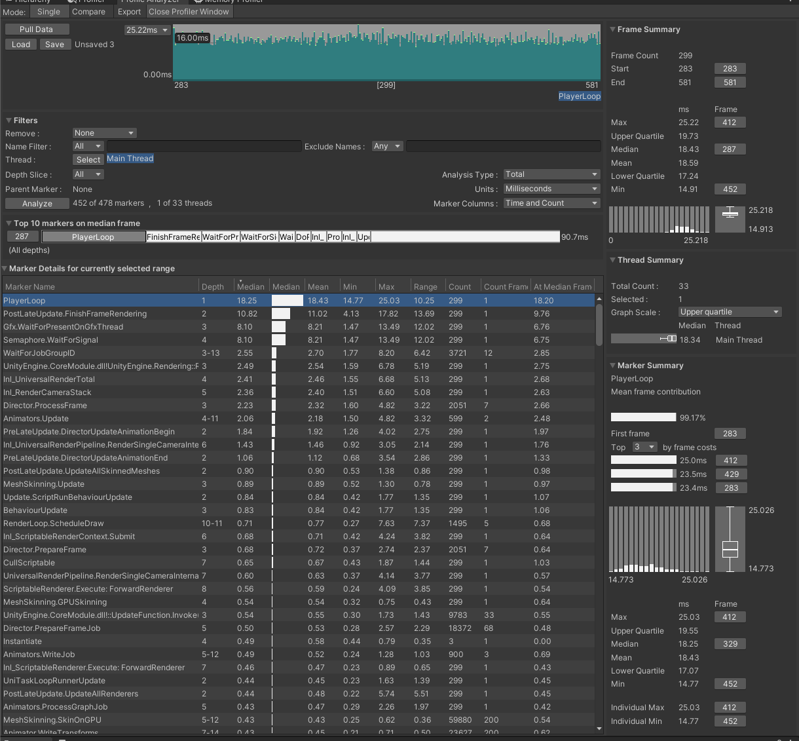](images/06-200bees-opaque-disk-profile-analyzer.png)

*Shipped: opaque disk, shadows off, median `18.43 ms`.*

<b>Captures:</b> what the blob actually drew, and the shadow pass being removed

[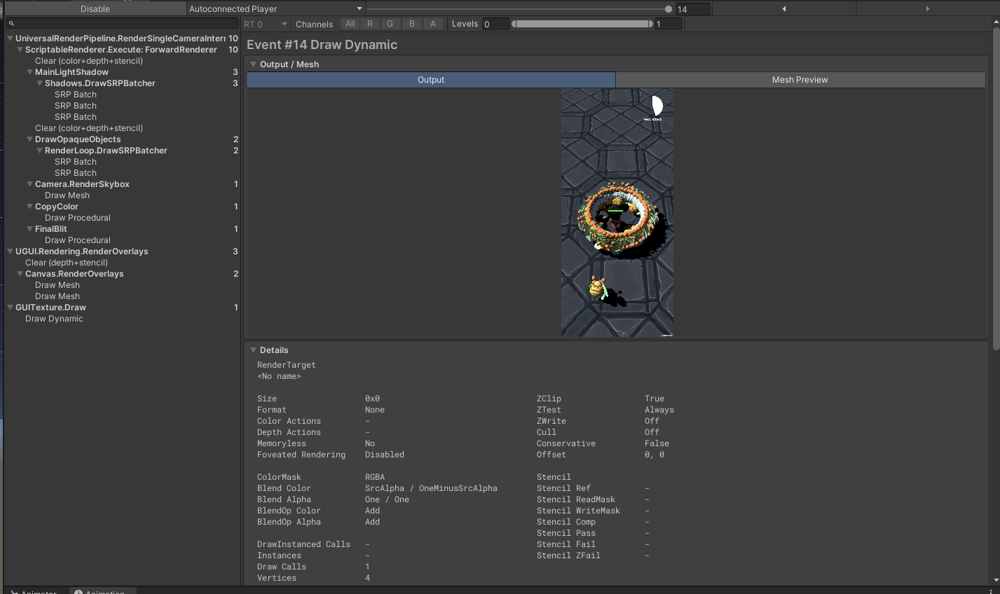](images/08-frame-debugger-transparent-blob.png)

*The blob variant in the Frame Debugger, showing alpha blended markers under the swarm
(`Blend SrcAlpha OneMinusSrcAlpha`). Every overlap costs fill rate.*

[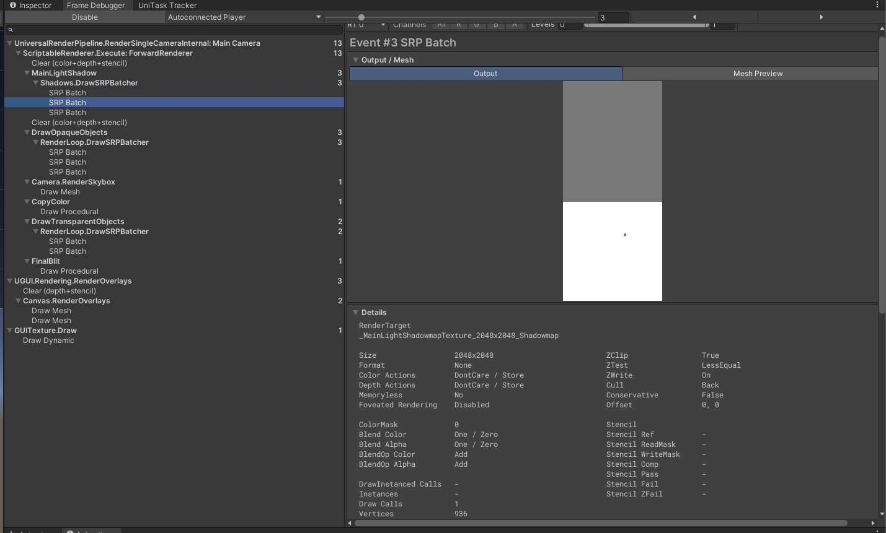](images/12-frame-debugger-shadow-pass.png)

*The pass being removed: `MainLightShadow` rendering SRP batches into a 2048x2048 shadowmap.*

---

## 4. Checking the shipped configuration

Independent confirmation that the shipped setup is what I claim, taken from the in game statistics
overlay rather than the Profiler:

| Metric | Value | What it confirms |
|---|---:|---|
| FPS | `60.0` (16.7 ms) | Hits the shipped target |
| Visible skinned meshes | `201` | About 200 bees plus the hero, so the stress scale is real |
| **Shadow casters** | **`0`** | Realtime shadows really are off |
| Batches / SetPass | 410 / 10 | |
| Triangles / Vertices | 188.0k / 135.3k | |

`BeeNormal.prefab` has `m_CastShadows: 0` on both renderers, so this is the shipped state, not an
intended one.

<b>Capture:</b> statistics overlay at 200 bees

[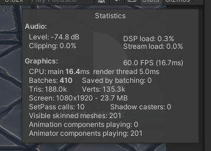](images/07-200bees-stats-overlay.png)

---

## 5. Other measured wins

**Recurring combat logs.** The base project logged on every combat event. Under stress profiling
`Debug.Log`, `Logger.Log`, `DebugLogHandler` and `LogStringToConsole` each sat at roughly **`1.1 ms`**
on the median frame, which is around 6% of a `19.87 ms` frame spent formatting strings and writing to
a console nobody was reading, per hit, per frame. This was inherited debt that the profiler surfaced,
not something I introduced. Removed. Visible in the marker table of
[capture 5](images/05-200bees-transparent-blob-profile-analyzer.png).

**Reused enemy update buffers.** The enemy controller allocates its id, update, attack and dash hit
lists once and clears them per frame, instead of allocating every frame.

**Removed one chase distance square root** from the per enemy movement path.

---

## 6. What I did not optimize, and the measurement that justifies it

**Object pooling.** The obvious optimization, and the wrong one at this scale. Profiling pointed to
per bee render cost (section 2), not spawn and destroy cost. To confirm that rather than assume it, I
took memory snapshots during spawn and death:

| Event | GC alloc in frame | Allocation count |
|---|---:|---:|
| Bee spawn | `9.7 KB` | 113 |
| Bee death | `19.3 KB` | 223 |

| Memory | Value |
|---|---:|
| Total resident on device | `419.0 MB` |
| Native | `292.7 MB` |
| Graphics (estimated) | `14.2 MB` |
| Managed | `2.5 MB` |
| Textures / Meshes | 80 (13.9 MB) / 9 (1.3 MB) |

`9.7 KB` to `19.3 KB` per event at a 20 enemy cap is not a frame budget problem, and total used
memory is flat across a 398 frame run, so there is no leak and no unbounded growth from the added
feedback systems. Pooling was deferred on evidence, not on assumption.

**What reverses this:** sustained concurrent entities above about 100, or constant wave churn at 200
and up. At that point this allocation rate becomes the thing to fix.

<b>Captures:</b> memory snapshots and stability

[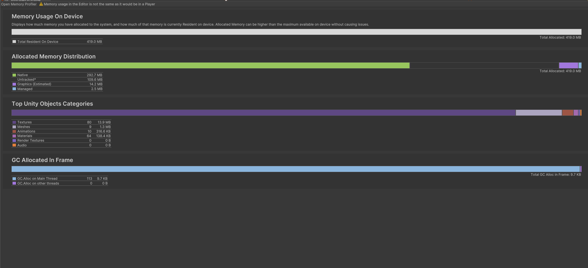](images/13-memory-bee-spawn.png)

*Bee spawn: `9.7 KB` GC alloc in frame across 113 allocations.*

[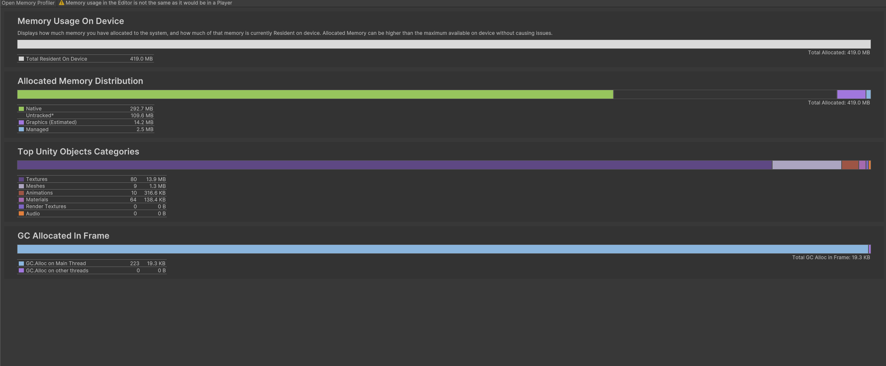](images/14-memory-bee-death.png)

*Bee death: `19.3 KB` GC alloc in frame across 223 allocations.*

[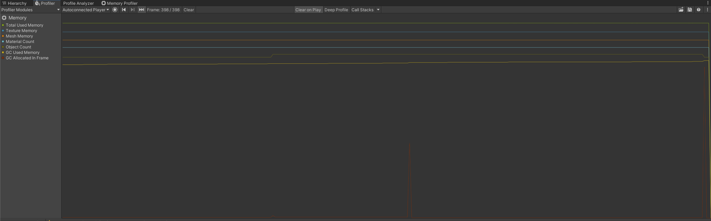](images/15-memory-timeline-stable.png)

*Memory module across 398 frames. `Total Used Memory` and `GC Used Memory` both flat.*

---

## 7. What breaks next

In the order it would actually happen, if enemy counts grew:

1. **GPU render cost.** Already the bottleneck at 200. Fix with GPU instancing for the ground disks,
   an LOD or impostor for distant bees, and fewer skinned mesh dispatches.
2. **Instantiate and destroy churn.** Pooling for enemies, health bars, pickups and weapon views,
   once the numbers above stop being negligible.
3. **Per entity `Update` callbacks.** Each bee currently runs its own `MonoBehaviour.Update` for
   facing and hit flash. Consolidate into the container view, or a `TransformAccessArray` job.
4. **The O(n²) separation pass.** Two passes over every enemy pair per frame. Free at the 20 enemy
   cap (about 380 comparisons), roughly 1M comparisons at 1000. Replace with a uniform grid sized to
   the separation distance. This is fourth, not first, because at 200 the renderer breaks well
   before it does.

---

## Capture index

All captures referenced above are in [`images/`](images/), unmodified and at original resolution.
Each screenshot in this document links to its full size version.

| # | File | Shows |
|---|---|---|
| 01 | [`01-baseline-20bees-profile-analyzer.png`](images/01-baseline-20bees-profile-analyzer.png) | 20 bees, median `11.08 ms` |
| 02 | [`02-baseline-20bees-profiler-hierarchy.png`](images/02-baseline-20bees-profiler-hierarchy.png) | 20 bees, CPU `10.87` / GPU `20.32` |
| 03 | [`03-200bees-no-marker-profile-analyzer.png`](images/03-200bees-no-marker-profile-analyzer.png) | 200 bees, no marker, `17.11 ms` |
| 04 | [`04-200bees-realtime-shadows-profile-analyzer.png`](images/04-200bees-realtime-shadows-profile-analyzer.png) | 200 bees, realtime shadows, `19.55 ms` |
| 05 | [`05-200bees-transparent-blob-profile-analyzer.png`](images/05-200bees-transparent-blob-profile-analyzer.png) | 200 bees, transparent blob, `19.87 ms`, plus logging cost |
| 06 | [`06-200bees-opaque-disk-profile-analyzer.png`](images/06-200bees-opaque-disk-profile-analyzer.png) | 200 bees, opaque disk, `18.43 ms` (shipped) |
| 07 | [`07-200bees-stats-overlay.png`](images/07-200bees-stats-overlay.png) | 60 FPS, 201 skinned meshes, 0 shadow casters |
| 08 | [`08-frame-debugger-transparent-blob.png`](images/08-frame-debugger-transparent-blob.png) | Blob markers, alpha blending |
| 09 | [`09-200bees-gpu-bound-shadows-on.png`](images/09-200bees-gpu-bound-shadows-on.png) | CPU `21.76` / GPU `44.67` |
| 10 | [`10-200bees-gpu-bound-marker-pass.png`](images/10-200bees-gpu-bound-marker-pass.png) | CPU `25.59` / GPU `62.77` |
| 11 | [`11-frame-debugger-gpu-skinning.png`](images/11-frame-debugger-gpu-skinning.png) | Per bee skinning, 6007 verts |
| 12 | [`12-frame-debugger-shadow-pass.png`](images/12-frame-debugger-shadow-pass.png) | 2048x2048 shadowmap pass |
| 13 | [`13-memory-bee-spawn.png`](images/13-memory-bee-spawn.png) | Spawn, `9.7 KB` GC |
| 14 | [`14-memory-bee-death.png`](images/14-memory-bee-death.png) | Death, `19.3 KB` GC |
| 15 | [`15-memory-timeline-stable.png`](images/15-memory-timeline-stable.png) | Flat memory over 398 frames |
